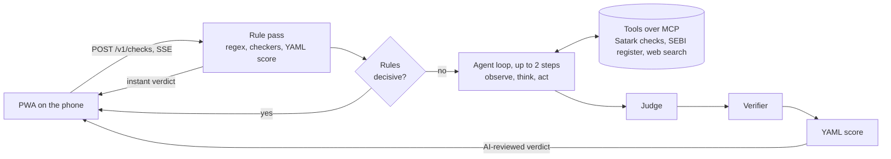

# Satark (सतर्क): check before you pay, learn before you invest

Satark is a voice-first web app (a PWA, progressive web app, which installs like an app on Android) for first-time
investors in India's Tier-2 and Tier-3 cities. It has two jobs, matching SANGYAN Tracks A and C:

- **Check (Track A).** Paste or share a WhatsApp or Telegram message, link, UPI ID, phone number or screenshot. Within
  about 2 seconds a rule pass answers **High risk**, **Suspicious**, **No strong risk signs found** or **Could not
  check**, with up to three plain-language reasons, each with its source (for example "SEBI register, 3 Oct"), what
  could not be checked, and next steps (call 1930, verify on SEBI Check, warn family). With an AI model on, a reviewed
  verdict follows a few seconds later. A message that only describes a known scam is labelled as such.
- **Ask and learn (Track C).** Ask a question by voice or text ("SIP kya hota hai?"), take 2-minute lessons (12) and play
  six simulators with Rs 0 at risk (fake trading app, "guaranteed return" maths, leverage wipe-out, fake "digital arrest"
  call, paid part-time job, "KYC update" remote access). Chat answers cite Satark's own FAQ, lessons and simulators.

English and Hindi are supported; more languages are a content-only change.

**Guardrails.** No stock tips, price targets or buy/sell calls; nothing is ever called "safe". No ads, no accounts. The
user's own Aadhaar, card, OTP, PIN, phone and account numbers are masked and discarded when a message arrives, and are
never stored, logged or sent to an AI model.

## Quick start

Needs [uv](https://docs.astral.sh/uv/) and Node.js 22.

```bash
uv sync --all-extras                       # Python 3.12 and dependencies (ingest and OCR extras)
uv run python -m satark.ingest             # build data/registry.db from the snapshots (~30 s; add --fetch for live phishing feeds)
npm --prefix web ci && npm --prefix web run build
SATARK_OFFLINE=1 scripts/start.sh          # http://localhost:8000, rules only, no AI, no outside lookups
uv run python -m satark.check "Guaranteed 5% daily profit, pay to rajesh@okaxis" --offline   # or check from the terminal
```

`data/registry.db` is already in a checkout, so the ingest step is only needed after changing `data/manual/`. For a
local Ollama model, a hosted model, dev mode, Docker and the mock model, see the [developer guide](docs/GUIDE.md).

## Documentation

| Document | Read it for |
|---|---|
| [`docs/GUIDE.md`](docs/GUIDE.md) | Every way to run it, codebase map, configuration reference (environment variables and `config/*.yaml`), content files, how-to recipes, troubleshooting. |
| [`docs/reference/Satark-LLD.md`](docs/reference/Satark-LLD.md) | Low-level design: how the system works internally. |
| [`docs/HARNESS.md`](docs/HARNESS.md) | The agent harness: flow, agent loop, MCP tools, judge and verifier, screenshots, voice, chat scope router. |
| [`docs/CONTRACTS.md`](docs/CONTRACTS.md) | The binding interfaces: HTTP API, event stream, config and content schemas. |
| [`docs/TEST-REPORT.md`](docs/TEST-REPORT.md) | Test method and measured results (accuracy, screenshots, load). All numbers live there. |
| [`docs/DEMO.md`](docs/DEMO.md), [`docs/BUILD-PLAN.md`](docs/BUILD-PLAN.md) | Demo script; build process. |

## How it works

Deterministic rules answer first. When they are not decisive, an LLM (large language model) investigates in a bounded
loop with pluggable MCP (Model Context Protocol) tools. A separate judge call lists risks with proof, a verifier drops
anything unproven, and a rule table sets the verdict: the model alone can raise it to Suspicious at most.



1. **Ingest.** Regular expressions find identifiers and mask them (`[UPI_1]`); the user's own values are discarded.
   Screenshots go through on-server OCR (optical character recognition) and, if configured, a local vision model.
2. **Rule pass, no model.** Checkers look up the SEBI register, debarred and caution lists, the `@valid` UPI rule,
   phishing feeds, look-alike domains, domain age, app listings and phone series; phrase rules and return maths run on
   the text. This verdict is shown at once and is the whole answer with no model or during an outage.
3. **Agent loop, judge, verifier.** Up to two tool-using steps, then a judge call and a verifier. Only public
   identifiers ever reach an external tool.
4. **Chat.** A scope router (`satark/harness/scope_router.py`, examples in `config/routes.yaml`) compares the message
   with example utterances using multilingual embeddings and declines off-topic and stock-tip requests without asking
   the chat model. Knowledge retrieval (`satark/harness/knowledge.py`) puts matching FAQ, lesson and simulator text,
   with citations, in the answer prompt. Output guards then check for tips, code, invented registration numbers and
   "this is safe" wording.

Full design: [LLD](docs/reference/Satark-LLD.md) and [HARNESS.md](docs/HARNESS.md).

## Testing

| Gate | Command |
|---|---|
| Lint | `uv run ruff check satark tests scripts` |
| Unit, contract, property-based and API tests | `uv run pytest -q` |
| Golden messages | `uv run python -m tests.golden.test_golden` |
| PWA unit tests, build, size budget | `npm --prefix web test -- --run && npm --prefix web run build && npm --prefix web run size` |
| Browser journeys (include the mock model) | `npm --prefix web run e2e` |
| Blind sets, chat set, screenshots, endpoints, load | `scripts/eval_set.py`, `eval_chat.py`, `eval_screens.py`, `validate_api.py`, `loadtest.py`; see [GUIDE.md](docs/GUIDE.md#run-the-evals) |

On a machine with limited memory (WSL), run one heavy process at a time. Results: [`docs/TEST-REPORT.md`](docs/TEST-REPORT.md).

## Deploy (Cloud Run, Mumbai)

The Dockerfile is self-contained: it builds the PWA and the registry database from the committed snapshots,
fetching phishing feeds when the build has network access.

```bash
gcloud run deploy satark --source . --region asia-south1 \
  --min-instances 1 --max-instances 1 --no-cpu-throttling --memory 1Gi \
  --set-env-vars SATARK_TRUST_PROXY=1[,SATARK_LLM=...]
```

- Use **one instance**: cases, event streams and rate limits live in process memory. Moving them to Redis
  is the scale-out step.
- Use **CPU always allocated** (`--no-cpu-throttling`): checks keep running after the `202` response.
- Set **secrets** as environment variables (or Secret Manager). None are needed for deterministic mode.
- Turn off **request-URL logging** at the platform level if possible: run ids travel in event-stream URLs.

## Project layout

| Path | Contents |
|---|---|
| `satark/` | FastAPI app, harness, checkers, ingest, MCP servers |
| `web/` | The PWA (Vite, Preact, TypeScript) and its tests |
| `config/` | YAML registries: entities, signals, scoring, modes, models, tools, routes, languages, sources, lexicons |
| `content/` | Lessons, simulators, FAQ, portals, UI strings (server and PWA share them) |
| `skills/`, `data/`, `scripts/`, `tests/`, `docs/` | Reviewed domain notes; raw snapshots and `registry.db`; run and eval scripts; tests; documentation |

A file-by-file map is in [GUIDE.md](docs/GUIDE.md#2-codebase-map).

## Data and licences

| Data | Source | Notes |
|---|---|---|
| SEBI-registered intermediaries (20,950 rows, 13 categories) | SEBI website exports, 3 Oct 2026 | SEBI asks for permission by email before reuse; requested |
| SEBI-debarred entities (11,762) | NSE list | PAN stored only as a SHA-256 hash; name-only matches count for firms, not people |
| Brokers' apps (550) and social handles (1,751) | NSE lists | Snapshots |
| FIU-IND non-compliance notice (25 offshore crypto platforms) | PIB release, 1 Oct 2025 | Names only |
| Phishing domains | Phishing.Database, Hagezi TIF | Popular and official domains are removed so platforms are never flagged |
| Popular websites in India | Chrome UX Report top list (Aug 2026) | CC BY |
| Domain age | RDAP (IANA bootstrap; NIXI for `.in`) | Live lookup, domain name only |
| App listings | Google Play | Live lookup, package id only |

## Known limits

- **Caution lists.** NSE, BSE and RBI caution notices are PDFs and are not loaded yet. Only the FIU-IND list
  is.
- **Hindi screenshots.** With `scripts/get_ocr_models.sh` the server reads Devanagari too, but with some vowel
  signs dropped; the 8B vision model reads Hindi poorly. See the screenshot results in the test report.
- **Web search** scrapes public search engines that rate-limit; a failed search is noted and the review goes on.
- **Not yet built.** Server-side streaming speech (designed in [`docs/HARNESS.md`](docs/HARNESS.md) §8),
  WhatsApp/Telegram bots and the nightly data refresh. Voice uses the phone's built-in speech: live transcript while
  speaking, the verdict read aloud with a spoken update if the AI review changes it, and a hands-free chat mode.
- **Text review.** Hindi text and skills await native-speaker and legal review.
- **Small local models.** With a 3B model the AI review adds recall but its labels are noisy (it can call a
  disguised offer a "routine notice"), so the verifier and the rule table bound what it can change; see the
  measured numbers in the test report. Hindi chat answers from a 3B model read poorly; use a 7B+ model for Hindi.
