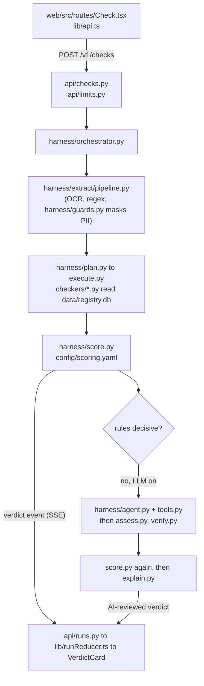

# Satark developer guide

How to run Satark, find your way around the code, configure it and extend it. For the design
(why it works the way it does) read [`reference/Satark-LLD.md`](reference/Satark-LLD.md) (LLD, low-level design) and
[`HARNESS.md`](HARNESS.md). For the HTTP API read [`CONTRACTS.md`](CONTRACTS.md). For measured results read
[`TEST-REPORT.md`](TEST-REPORT.md).

**Contents**
1. [Run it](#1-run-it)
2. [Codebase map](#2-codebase-map)
3. [How a check, a chat turn and a lesson flow through the code](#3-how-things-flow-through-the-code)
4. [Configuration reference](#4-configuration-reference): environment variables, `config/*.yaml`
5. [Content files](#5-content-files)
6. [Common tasks](#6-common-tasks)
7. [Troubleshooting](#7-troubleshooting)

Terms used below: **LLM** (large language model) is the AI text model; **MCP** (Model Context Protocol) is a
standard for plugging tools into an AI agent; **OCR** (optical character recognition) reads text from a
screenshot; **VLM** (vision-language model) is an LLM that also reads images; **PWA** (progressive web app) is the
web front end that installs like an app; **SSE** (Server-Sent Events) is the one-way event stream from server to
browser; **RAG** (retrieval-augmented generation) means fetching relevant text and putting it in the LLM prompt;
**BM25** is a keyword-ranking formula; **RRF** (reciprocal rank fusion) merges two rankings.

---

## 1. Run it

Prerequisites: [uv](https://docs.astral.sh/uv/) (Python package manager; the project needs Python 3.12, which uv
installs) and Node.js 22. All commands run from the repo root.

### 1.1 First-time setup

| Step | Command | What it does |
|---|---|---|
| Python dependencies | `uv sync --all-extras` | Creates `.venv`. `--all-extras` adds `ingest` (reads the SEBI `.xls` files) and `ocr` (on-server screenshot OCR). |
| Registry database | `uv run python -m satark.ingest --fetch` | Builds `data/registry.db` from the snapshots in `data/manual/`. `--fetch` first downloads live phishing feeds. Drop `--fetch` to build offline. About 30 s. |
| Web dependencies | `npm --prefix web ci` | Installs exact versions from `web/package-lock.json`. |
| Build the PWA | `npm --prefix web run build` | Writes `web/dist/`, which the API serves. |

`data/registry.db` already exists in a checkout; re-run the ingest only after changing `data/manual/` or `config/sources.yaml`.
The semantic chat features download an embedding model on first use (see [7.4](#74-the-embedding-model-download)).

### 1.2 Offline, without AI (the rule pass only)

```bash
SATARK_OFFLINE=1 scripts/start.sh            # http://localhost:8000
```

With no `SATARK_LLM`, every LLM role is off: extraction is regex, explanations are templates, chat answers come from
the FAQ and retrieval. `SATARK_OFFLINE=1` also stops live lookups (RDAP, Play Store, redirects, web search); they report
"could not check". Leave it out if the machine has internet. `scripts/start.sh` builds `web/dist` if it is missing,
then runs one uvicorn worker on `$PORT` (default 8000).

Command-line check, no server:

```bash
uv run python -m satark.check "Guaranteed 5% daily profit, pay to rajesh@okaxis" --lang en --offline
```

It prints each event as one JSON line.

### 1.3 With a local Ollama model

Ollama is a local server that runs open-weight LLMs and exposes an OpenAI-compatible API on port 11434.

```bash
ollama pull qwen3:4b-instruct-2507-q4_K_M   # reasoning: agent loop, judge, chat (the chosen model, see TEST-REPORT; fits an 8 GB GPU)
ollama pull minicpm-v:8b            # optional: screenshot reading (VLM)
# better judgement and Hindi, needs more memory:
ollama pull qwen2.5:7b-instruct

SATARK_LLM=local:qwen3:4b-instruct-2507-q4_K_M scripts/start.sh
# Ollama on another machine, plus the screenshot model:
SATARK_LLM=local:qwen3:4b-instruct-2507-q4_K_M SATARK_LLM_BASE_URL=http://<ollama-host>:11434/v1 \
  SATARK_LLM_IMAGE=local:minicpm-v:8b scripts/start.sh
```

The model id format is `local:<model name exactly as in ollama list>`. Any OpenAI-compatible server (LM Studio, vLLM,
llama.cpp) works the same way via `SATARK_LLM_BASE_URL`. For Hindi screenshots also run `scripts/get_ocr_models.sh` (see 7.5).

### 1.4 With a hosted model

```bash
export ANTHROPIC_API_KEY=...        # PydanticAI reads the provider credential itself
SATARK_LLM=anthropic:claude-haiku-4-5 scripts/start.sh
```

Other providers: `google-gla:gemini-2.5-flash` with `GEMINI_API_KEY`; `vertex-claude:claude-haiku-4-5` with
`GOOGLE_CLOUD_PROJECT` (and `CLAUDE_REGION`, default `us-east5`). Per-role models and fallback chains:
see the `SATARK_LLM_<ROLE>` row in [section 4.1](#41-environment-variables). Do not set `SATARK_LLM_IMAGE` to a hosted
model: screenshots can show the user's own data.

### 1.5 Dev mode (API with reload, plus Vite)

```bash
scripts/dev.sh
```

Runs `uvicorn --reload` on :8000 and the Vite dev server on its default port 5173 (open
http://localhost:5173). Vite proxies `/v1`, `/healthz`, `/readyz` and `/share` to :8000 (`web/vite.config.ts`).
Ctrl-C stops both. Pass model variables the same way as above, for example `SATARK_LLM=... scripts/dev.sh`.

### 1.6 Docker

```bash
docker build -t satark .                              # multi-stage: builds the PWA and registry.db, then the runtime image
docker build -t satark --build-arg INSTALL_OCR=true . # adds screenshot OCR and the Devanagari model
docker run -p 8080:8080 satark                        # deterministic mode; http://localhost:8080
docker run -p 8080:8080 -e SATARK_LLM=anthropic:claude-haiku-4-5 -e ANTHROPIC_API_KEY=... satark
```

The container listens on `$PORT` (default 8080) with one worker; cases and rate limits live in process memory, so do not
scale beyond one instance. Cloud Run deployment is in the [README](../README.md#deploy-cloud-run-mumbai).

### 1.7 The deterministic mock LLM (for tests)

`scripts/mock_llm.py` is a scripted server that speaks the OpenAI API and plays every LLM role, so the AI path runs
with no real model. Triggers `[[mock:tip]]`, `[[mock:code]]`, `[[mock:ungrounded]]`, `[[mock:500]]` and `[[mock:slow]]` in a
message make it misbehave on purpose to test the guards, verifier, fallback and timeouts.

```bash
uv run python scripts/mock_llm.py --port 9100 &
SATARK_LLM=local:satark-mock SATARK_LLM_BASE_URL=http://127.0.0.1:9100/v1 SATARK_OFFLINE=1 scripts/start.sh
```

Playwright (`npm --prefix web run e2e`) starts its own deterministic server and mock-LLM server
(`web/playwright.config.ts`). Test gates are listed in the [README](../README.md#testing).

---

## 2. Codebase map

### 2.1 Top level

| Path | What it is |
|---|---|
| `satark/` | The Python server package (FastAPI app, harness, checkers, ingest, MCP servers). |
| `web/` | The PWA: Vite + Preact + TypeScript, with unit tests (Vitest) and browser tests (Playwright, `web/e2e/`). |
| `config/` | YAML registries that drive behaviour; validated at startup. Section 4.2. |
| `content/` | User-facing text and learning content as JSON, shared by server and PWA. Section 5. |
| `data/` | `manual/` raw snapshots with `.meta.yaml` sidecars, `registry.db` (built SQLite file), `cache/feeds/`, `models/ocr-hi/` (optional OCR model, not in git). |
| `skills/` | Reviewed domain notes (`<area>/<name>/SKILL.md`) that the explainer and chat load on demand. |
| `scripts/` | Run, eval and test helper scripts. Section 2.5. |
| `tests/` | `unit/`, `api/`, `contract/`, `golden/` (labelled message sets), `fixtures/`, `e2e/`. |
| `docs/` | This guide, `HARNESS.md`, `CONTRACTS.md`, `TEST-REPORT.md`, `BUILD-PLAN.md`, `DEMO.md`, `reference/` (LLD, sources, research). |
| `Dockerfile`, `pyproject.toml`, `uv.lock` | Container build; Python dependencies and optional extras (`ingest`, `ocr`); pinned versions. |

### 2.2 `satark/`

| Module | What it does |
|---|---|
| `app.py` | FastAPI app factory `create_app` (`uvicorn satark.app:create_app --factory`): mounts the routers, builds the runtime at startup. |
| `config.py` | `Settings.from_env` (paths, env copy, offline flag) and `Config` (loads and validates every YAML in `config/`). |
| `check.py` | `python -m satark.check`: runs one check with no server and prints events as JSON lines. |
| `api/` | HTTP layer. `checks.py` (`POST /v1/checks`), `chat.py` (`/v1/chat`), `practice.py` (`POST /v1/practice`: on-demand 3-question quiz built by `harness/practice.py` from lesson chunks with the `practice` model role, falling back to the lessons' static quizzes), `runs.py` (SSE event stream), `report.py`, `feedback.py`, `share.py` (Android share target), `meta.py` (`/v1/meta`, health), `limits.py` (body cap, per-IP rate limit), `errors.py`, `static.py` (serves the PWA). |
| `harness/orchestrator.py` | Owns one check or chat run end to end. |
| `harness/runtime.py` | Builds the shared objects once at startup (config, DB, checkers, model router, scope router, knowledge base). |
| `harness/extract/` | Turns input into entities: `pipeline.py`, regex `match.py`, `normalise.py`, `fns.py`, `ocr.py` (screenshots), `llm.py` (LLM extraction). |
| `harness/plan.py`, `execute.py`, `join.py` | Rule planner (entity type to checkers), parallel wave executor with timeouts and retries, and the decision to finish or run another wave. |
| `harness/agent.py`, `tools.py`, `context.py` | The bounded agent loop (observe, think, act), its tool layer (built-in checks plus MCP servers), and the token-budgeted prompt builder. |
| `harness/assess.py`, `verify.py` | The judge (risks with proof) and the verifier that drops unproven claims; `verify.py` also detects messages that merely describe a scam. |
| `harness/score.py` | Evidence to verdict, from `config/scoring.yaml`. The LLM never sets the level. |
| `harness/explain.py`, `skills.py` | Grounded explanation (LLM or template) and the skill-note loader. |
| `harness/respond.py` | Chat turn: scope check, agent loop, retrieval, answer, output guards. |
| `harness/scope_router.py` | Chat scope router: embeds the message and compares it with example utterances in `config/routes.yaml` to decide money question, stock tip or off-topic. |
| `harness/knowledge.py` | Retrieval over FAQ, lesson and sim text (BM25 plus embeddings, merged by RRF) with citations. |
| `harness/guards.py` | PII (personally identifiable information) masking, LLM input building, output guards (no tips, code, "this is safe"). |
| `harness/models.py` | `ModelRouter`: role to model chain, output mode, timeouts, circuit breaker, daily cost cap. |
| `harness/vision.py` | Screenshot reading: OCR for exact identifiers, optional VLM for the rest. |
| `harness/state.py`, `budget.py`, `cases.py`, `events.py`, `report.py` | Shared data models; time and call budgets; in-memory cases (30 min TTL); SSE event bus with replay; complaint-draft template. |
| `checkers/` | One deterministic check per class, registered with `@register_checker`. `sebi.py` (registry, debarred, caution), `payment.py` (UPI, QR), `link.py` (shorteners, blocklists, domain age, look-alikes), `phone.py`, `apps.py`, `social.py`, `names.py`, `text.py` (phrase rules, return maths). `base.py` is the plugin contract; `registry.py` discovers and validates them. |
| `infra/` | `db.py` (read-only SQLite), `http.py` (the only network path, with an SSRF guard), `norm.py` (shared normalisers), `validators.py`. |
| `ingest/` | `python -m satark.ingest`: builds `registry.db` from `data/manual/` (`sebi.py`, `nse.py`, `crux.py`, `feeds.py`, `curated.py`), with gates in `gate.py` and tables in `schema.sql`. |
| `mcp_servers/` | `satark_server.py` exposes Satark's checks as an MCP server; `websearch.py` is the web-search MCP server the agent loop uses. |

### 2.3 `web/src`

| Path | What it does |
|---|---|
| `main.tsx`, `app.tsx`, `sw.ts`, `styles.css` | Entry point; the router (`preact-iso`); the service worker (offline shell, share target); global styles. |
| `routes/` | One file per screen: `Home`, `Check`, `Run` (live verdict), `Chat`, `Learn`, `LessonPlayer`, `Practice`, `SimPlayer`, `HelpPaid`, `History`, `Settings`, `AboutData`, `Onboarding`. |
| `components/` | Shared UI: `VerdictCard`, `Explanation`, `SourceChip`, `ActionButtons`, `QuizFlow`, `Checklist`, `AskUser`, `SpeakerButton`, `Shell`, and `visuals/` (compounding and leverage charts). |
| `lib/` | Non-UI logic. `api.ts` (HTTP and SSE client), `runReducer.ts` (events to screen state), `i18n.ts` (UI strings), `lessons.ts`, `sims.ts`, `faq.ts`, `portals.ts` (load `content/` at build time), `sim/` (simulator engines S1-S3), `voice.ts`, `speechInput.ts`, `image.ts`, `idb.ts` (history in the browser's IndexedDB), `languages.ts`. |
| `types/` | Global TypeScript declarations. |

### 2.4 `config/`, `content/`, `data/`

See [section 4.2](#42-configyaml-files) for `config/`, [section 5](#5-content-files) for `content/`, and 2.1 for `data/`.

### 2.5 `scripts/` and `tests/`

| Path | What it does |
|---|---|
| `scripts/start.sh`, `dev.sh` | Run the server; run server plus Vite with reload. |
| `scripts/mock_llm.py` | Scripted OpenAI-compatible test model (1.7). |
| `scripts/eval_set.py`, `eval_chat.py`, `eval_screens.py` | Evaluate message sets, the chat set, and screenshots through the real harness. |
| `scripts/eval_all.sh`, `eval_errors.py` | Run all sets into one folder; group misses by type and diff two runs. |
| `scripts/validate_api.py`, `loadtest.py` | Black-box endpoint checks and a concurrent-check load test against a running server. |
| `scripts/get_ocr_models.sh` | Downloads the Devanagari OCR model into `data/models/ocr-hi/`. |
| `scripts/make_screens.mjs`, `fonts/` | Generates the screenshot test images. |
| `tests/unit/` | One file per module (checkers, harness parts, content schema). |
| `tests/api/`, `tests/contract/` | Endpoint tests with fakes; the generated contract test every checker must pass. |
| `tests/golden/` | Labelled messages (`cases.yaml`, `heldout*.yaml`, `online_v1.yaml`, `chat_v1.yaml`) for accuracy runs. |
| `tests/fixtures/` | Fixture database, recorded HTTP replies, sample screens. |

---

## 3. How things flow through the code

### 3.1 A check



1. The PWA posts the text, link or image to `/v1/checks`; the API applies size and rate limits and returns `202` with a run id.
2. The orchestrator extracts entities (UPI IDs, links, phones). Values belonging to the user are masked and discarded.
3. The rule planner maps each entity type to checkers; the executor runs them in parallel waves against `registry.db` and live lookups.
4. `score.py` turns the evidence into a verdict using `config/scoring.yaml`; it streams to the browser over SSE at once.
5. If the rules are not decisive and an LLM is configured, the agent loop, judge and verifier refine it. A model alone can raise the level to Suspicious at most.
6. A message that only describes a known scam gets `about_scam` set (`verify.py`), and the card shows the "describes a known scam" headline.

Details: [LLD](reference/Satark-LLD.md) and [HARNESS.md](HARNESS.md).

### 3.2 A chat turn

`routes/Chat.tsx` posts to `api/chat.py`; `harness/respond.py` then does:

1. Checks any pasted identifiers first (same checkers as above).
2. `scope_router.py` embeds the message; if it is closest to `off_topic` or `stock_tip_request` in `config/routes.yaml`, the reviewed refusal is returned with no LLM call.
3. Otherwise the agent loop may call tools (`satark.*`, web search limited to official domains) within the `chat` limits in `config/modes.yaml`.
4. `knowledge.py` retrieves the top 4 FAQ, lesson and sim chunks; the model answers citing them.
5. `guards.py` rejects stock tips, code, invented registration numbers and "safe" claims (the model is asked to retry). With no LLM, the FAQ answer is used.

### 3.3 A lesson or simulator

Both are static content, no server call. At build time `lib/lessons.ts` and `lib/sims.ts` read every file in
`content/lessons/` and `content/sims/` (`import.meta.glob`). `routes/Learn.tsx` lists them, `LessonPlayer.tsx` plays
steps then `components/QuizFlow.tsx`, and `SimPlayer.tsx` runs the engine for the sim `kind`
(`fsm` state machine, `returns`, `leverage`; engines in `lib/sim/`). A lesson's `sim` field links to a sim.
`config/scoring.yaml` `lesson_by_scam_type` picks the lesson shown under a verdict. The server also indexes lessons and sims for chat retrieval (`knowledge.py`).

---

## 4. Configuration reference

Config is read at startup; restart after any change. A broken YAML or a missing signal title stops the app from starting
(`satark/config.py` `validate_config`).

### 4.1 Environment variables

| Variable | What it does | Default | Example |
|---|---|---|---|
| `SATARK_LLM` | Model for every role (`extract`, `assess`, `explain`, `respond`). Empty means deterministic mode. Format `provider:model`; providers: `local`, `anthropic`, `google-gla`, `vertex-claude`. | empty (no LLM) | `local:qwen2.5:3b-instruct` |
| `SATARK_LLM_EXTRACT`, `_ASSESS`, `_EXPLAIN`, `_RESPOND` | Model for one role, overriding `SATARK_LLM`. A comma list is a fallback chain. `ASSESS` is the check's agent loop and judge; `RESPOND` is chat. | inherit `SATARK_LLM` | `SATARK_LLM_RESPOND=anthropic:claude-sonnet-5,google-gla:gemini-2.5-flash` |
| `SATARK_LLM_IMAGE` | VLM that reads screenshots. Never inherited from `SATARK_LLM`. | off | `local:minicpm-v:8b` |
| `SATARK_LLM_VISION` | `1` sends the screenshot itself to the model. Use only with a local model. | off (OCR text only) | `1` |
| `SATARK_LLM_BASE_URL` | Server URL for `local:` models. | `http://127.0.0.1:11434/v1` | `http://gpu-box:11434/v1` |
| `SATARK_LLM_API_KEY` | API key sent to the `local:` server (most local servers ignore it). | `local` | `sk-local` |
| `SATARK_LLM_OUTPUT_MODE` | How structured output is requested: `native` (schema enforced while decoding), `tool`, or `prompted`. Also settable per role as `output_mode` in `config/models.yaml`. | `native` for `local:`, `tool` for hosted | `prompted` |
| `ANTHROPIC_API_KEY`, `GEMINI_API_KEY` | Hosted-provider credentials, read by PydanticAI. | unset | `sk-ant-...` |
| `GOOGLE_CLOUD_PROJECT` (or `GCP_PROJECT`), `CLAUDE_REGION` | Project and region for `vertex-claude:`. | region `us-east5` | `my-proj`, `asia-south1` |
| `SATARK_OFFLINE` | `1`, `true` or `yes` stops outside lookups (RDAP, Play Store, redirects, web search); they report "could not check". | off | `1` |
| `SATARK_RATE_LIMIT_SCALE` | Multiplies the per-IP rate limits; `0` turns them off. | `1` | `0` (tests, load runs) |
| `SATARK_TRUST_PROXY` | `1` makes rate limits use the right-most `X-Forwarded-For` entry (Cloud Run). | off | `1` |
| `SATARK_ROOT` | Repo root used to find `config/`, `content/`, `data/`. | the checkout | `/app` |
| `SATARK_DB` | Path of the registry database. | `<root>/data/registry.db` | `/tmp/registry.db` |
| `SATARK_WEB_DIST` | Folder of the built PWA that the API serves. | `<root>/web/dist` | `/srv/dist` |
| `SATARK_WEBSEARCH_BACKEND` | Web-search backend: `ddgs` (real) or `fake` (canned results, no network). Set in `config/tools.yaml`. | `ddgs` | `fake` |
| `SATARK_SAFE_BROWSING_KEY` | Optional free Google Safe Browsing key; enables `link.safe_browsing` (disabled and listed in `/v1/meta` without it). | off | `AIza...` |
| `SATARK_WEBSEARCH_ENGINES` | Comma list of search engines tried in order. | `duckduckgo,yahoo,mojeek,brave` | `duckduckgo,brave` |
| `FASTEMBED_CACHE_PATH` | Where the embedding model is cached (not a `SATARK_` name, read in `scope_router.py`). | `~/.cache/fastembed` | `/data/fastembed` |
| `PORT` | Port for `scripts/start.sh`, `dev.sh` and the Docker image. | 8000 (8080 in Docker) | `9000` |

MCP tool servers started by the agent loop inherit every `SATARK_*` variable.

### 4.2 `config/*.yaml` files

| File | Controls | Keys people change |
|---|---|---|
| [`models.yaml`](../config/models.yaml) | Per-role timeouts, token limits, temperature, prices, cost cap, circuit breaker. | `roles.<role>.timeout_s` and `step_timeout_s` (raise for slow models); `daily_cost_cap_usd`; `breaker_failures` and `breaker_pause_s`. |
| [`modes.yaml`](../config/modes.yaml) | Per-mode (`check`, `chat`) planner, LLM roles, limits and deadlines. | `limits.agent_steps`, `agent_deadline_s`, `judge_timeout_s`; `ai_concurrency` and `ai_queue_wait_s`; `assess_skip_when_sure`. |
| [`tools.yaml`](../config/tools.yaml) | Toolsets for the agent loop (built-in checks and MCP servers). | `max_calls_per_run`, `menu_size`; add a toolset; `chat_domains` (sites chat may cite). |
| [`routes.yaml`](../config/routes.yaml) | Example utterances for the chat scope router. | Add utterances under `money_or_scam_question`, `stock_tip_request`, `off_topic`. |
| [`scoring.yaml`](../config/scoring.yaml) | Rules mapping signals to High risk, Suspicious, No signs, Unknown; default actions; lesson per scam type. | `levels`, `ai_only_max_level`, `lesson_by_scam_type`, `max_reasons`. |
| [`signals.yaml`](../config/signals.yaml) | Every signal code: polarity (risk, assurance, info, flag), weight, skill note, actions, scam types. | `weight` of a code; a new code (needs titles in `content/i18n`). |
| [`entities.yaml`](../config/entities.yaml) | Entity types: regex patterns, privacy class (U, C, P, R), mask prefix, normalise and validate functions. | `patterns`; `max_per_case`; a new type (never rename one). |
| [`lexicons/redflags.yaml`](../config/lexicons/redflags.yaml) | Scam-phrase regexes per signal code and language (`en`, `hi`, `hinglish`). | Add a regex under a code. |
| [`lexicons/guards.yaml`](../config/lexicons/guards.yaml) | Regexes the output guards reject (tips, "is safe", and similar). | Add a pattern under a section. |
| [`claim_rules.yaml`](../config/claim_rules.yaml) | Return-maths thresholds and the claim-type to signal-code map. | `impossible_annual_return`; entries under `map`. |
| [`brands.yaml`](../config/brands.yaml) | Known organisations, aliases and official domains. | Add a brand line (feeds look-alike and impersonation checks). |
| [`link_rules.yaml`](../config/link_rules.yaml) | URL shortener hosts and other link rules. | `shorteners`. |
| [`phone_rules.yaml`](../config/phone_rules.yaml) | TRAI 1600-series deadlines and official helpline allow-list. | `helplines`, `sector_deadlines`. |
| [`sources.yaml`](../config/sources.yaml) | Data sources for the registry DB: file, table, gates, max age, licence. | `path`, `gates.min_rows`, `max_age_days`; a new source. |
| [`languages.yaml`](../config/languages.yaml) | Languages, speech tags, `enabled` flag. | `enabled`. |

---

## 5. Content files

All under [`content/`](../content), bilingual (`en`, `hi`) as `{"en": "...", "hi": "..."}` objects. Run
`uv run pytest -q tests/unit/test_content.py` after any change; it checks the schema, both languages and cross-references.

| File | Schema in brief |
|---|---|
| `lessons/<id>.json` | `id`, `icon`, `minutes`, `title`, `tactic`, `tacticKey`, optional `sim` (a sim id), `steps[]` (`text`, optional `visual`), `analogy`, `quiz` (`question`, `options[]` with `id`, `text`, `correct`; `explain`; `tactic`). 12 lessons. |
| `sims/<id>.json` | `id`, `kind` (`fsm`, `returns`, `leverage`), `version`, `title`, `quiz[]`. `fsm` adds `start`, `vars`, `states` (S1, S4, S5, S6). `returns` and `leverage` add `texts` and `defaults` (S2, S3). 6 sims. |
| `faq.json` | `intents[]` (`id`, `patterns` keyword list, `answer`, `actions`, `chips`) and a `fallback`. Used for deterministic chat and as retrieval text. |
| `portals.json` | Official portals (`url`, `phone`, `source`) and the `actions` ids that verdict and chat buttons use. |
| `i18n/ui.<lang>.json` | Flat `"ui.<key>": "text"` strings for the PWA. Missing keys fall back to English. |
| `i18n/content.<lang>.json` | Flat strings the server returns: `signal.<CODE>` titles, `action.<id>` labels. Every enabled language needs a title for every signal. |

---

## 6. Common tasks

### Add a scam phrase rule
1. In `config/lexicons/redflags.yaml`, add a regex under an existing signal code and language (`en`, `hi` or `hinglish`). Keep it precise: word boundaries, short windows.
2. Negated mentions ("never share your OTP") are ignored automatically by `checkers/text.py`.
3. Add a labelled case to `tests/golden/cases.yaml`, then `uv run pytest -q tests/unit/test_checkers_text.py && uv run python -m tests.golden.test_golden`.
4. A new signal code also needs an entry in `config/signals.yaml` and titles in `content/i18n/content.<lang>.json`.

### Add a registry or checker
1. New file in `satark/checkers/` with a class decorated `@register_checker` (contract in `checkers/base.py`): it declares the entity types it consumes and the signal codes it produces.
2. Add the codes to `config/signals.yaml` and their titles to `content/i18n/content.<lang>.json`.
3. For a new data table: add the file and `.meta.yaml` to `data/manual/`, an entry in `config/sources.yaml`, a loader in `satark/ingest/`, then `uv run python -m satark.ingest`.
4. `uv run pytest -q tests/contract` runs the generated contract test against every checker.

### Add an MCP tool server
1. Add a toolset to `config/tools.yaml` (a commented `fetch` example is there): `kind: mcp_stdio`, `command`, `privacy: external` if it reaches the internet, `public_types` (identifier types allowed to leave), and per tool `modes` and `max_calls`.
2. Restart. Tools are discovered with `tools/list`; a tool with one string parameter such as `query` or `url` gets menu entries from the case's identifiers (add `suggest:` to control it).
3. Check `GET /v1/meta` for the toolset's status.

### Add a chat route example
1. Add one utterance to the right route in `config/routes.yaml` (`money_or_scam_question`, `stock_tip_request` or `off_topic`); mix English, Hindi and Hinglish.
2. Do not copy lines from `tests/golden/chat_v1.yaml`: that would leak the evaluation set into the router.
3. Restart, then run `uv run python scripts/eval_chat.py`.

### Add a lesson with a quiz
1. Copy `content/lessons/leverage.json` to `content/lessons/<new-id>.json`; edit steps, analogy and `quiz`, with `en` and `hi` text throughout.
2. To show it under a verdict, add `T<n>: <new-id>` in `lesson_by_scam_type` in `config/scoring.yaml`.
3. `uv run pytest -q tests/unit/test_content.py`; `npm --prefix web run build`. The lesson list is read from the folder, so no code change is needed.

### Add a language
1. Copy `content/i18n/content.en.json` and `ui.en.json` to `content.<code>.json` and `ui.<code>.json` and translate.
2. Add the language to every lesson, sim, FAQ and portal text object in `content/`.
3. Set `enabled: true` in `config/languages.yaml` (`mr`, `bn`, `ta`, `te` are listed, disabled). Startup refuses a language with a missing signal title.
4. Phrase rules for the new language go under a new key in `config/lexicons/*.yaml`; the encoder already handles many languages for routing.

### Switch the model
Change `SATARK_LLM` (and `SATARK_LLM_BASE_URL` for `local:`); no code or YAML change. One role only: `SATARK_LLM_RESPOND=...`.
A slower model needs larger `timeout_s` values in `config/models.yaml` and `config/modes.yaml`. Confirm with `curl localhost:8000/v1/meta` (the `llm` field shows each role's state).

### Run the evals
Run one at a time (see 7.3). Results are interpreted in `TEST-REPORT.md`.

| Script | Command | Purpose |
|---|---|---|
| `scripts/eval_set.py` | `uv run python scripts/eval_set.py tests/golden/heldout_v3.yaml [--json out.json] [--network]` | Scam caught and false-alarm counts for a message set; add `SATARK_LLM=...` for the AI review. |
| `scripts/eval_chat.py` | `uv run python scripts/eval_chat.py [--json out.json]` | Chat scope decisions, required content, guards (`tests/golden/chat_v1.yaml`). |
| `scripts/eval_screens.py` | `uv run python scripts/eval_screens.py [--json out.json]` | Screenshots: OCR, VLM, verdicts. |
| `scripts/eval_all.sh` | `SATARK_LLM=... scripts/eval_all.sh out_dir [--network]` | All of the above in sequence into `out_dir`. |
| `scripts/eval_errors.py` | `uv run python scripts/eval_errors.py tests/golden/heldout_v3.yaml a.json [b.json]` | Group misses by type and language; with two runs, list what changed. |

---

## 7. Troubleshooting

| Problem | Cause and fix |
|---|---|
| **7.1 Ollama not reachable.** The check shows only the rule verdict; `/v1/meta` shows the `llm` roles off or failing. | Check `curl http://127.0.0.1:11434/api/tags`. Start `ollama serve`; run `ollama pull <model>`; make sure the model name after `local:` matches `ollama list`. From WSL or Docker to a Windows host, set `SATARK_LLM_BASE_URL` to the host's address, not 127.0.0.1. After 3 failures (`breaker_failures`) a role is skipped for 60 s, so wait or restart. |
| **7.2 The model is too slow.** AI verdict never arrives, or the rule verdict stays final. | Raise `roles.assess.timeout_s` and `step_timeout_s` (and `respond`) in `config/models.yaml`, and `agent_deadline_s` and `judge_timeout_s` in `config/modes.yaml`. Lower `agent_steps` to 1. `ai_queue_wait_s` is how long a check waits for a free AI slot before falling back to the rule verdict. Use a smaller model. |
| **7.3 WSL memory.** Windows Subsystem for Linux (WSL) has about 11 GB; two heavy processes can crash it and wipe `/tmp`. | Run one heavy process at a time: one eval, one Ollama model, one Playwright run. The embedding encoder alone takes about 0.5 GB per process. Do not run `eval_all.sh` while the dev server and a model are both loaded. |
| **7.4 The embedding model download.** The first chat starts slowly, or the router logs "encoder ... unavailable". | `fastembed` downloads `paraphrase-multilingual-MiniLM-L12-v2` (ONNX) into `~/.cache/fastembed` (not `/tmp`, which WSL wipes). It needs internet once. If it cannot load, the router and retrieval switch off and chat uses the model's own scope label and the FAQ. Set `FASTEMBED_CACHE_PATH` to move the cache. |
| **7.5 OCR models.** Hindi screenshots are read poorly or not at all. | Latin OCR comes with `uv sync --all-extras`. For Devanagari run `scripts/get_ocr_models.sh` (about 9 MB into `data/models/ocr-hi/`). Without the `ocr` extra a screenshot needs `SATARK_LLM_IMAGE`. Some Hindi vowel signs are still dropped. |
| **Blank page at :8000.** | `web/dist` is missing: `npm --prefix web ci && npm --prefix web run build`. |
| **App refuses to start.** | The error names a config validation failure (a signal without a title, an enabled language with missing text). Fix the named file. |
| **"Could not check" for links or apps.** | `SATARK_OFFLINE=1` is set, or there is no internet. |
