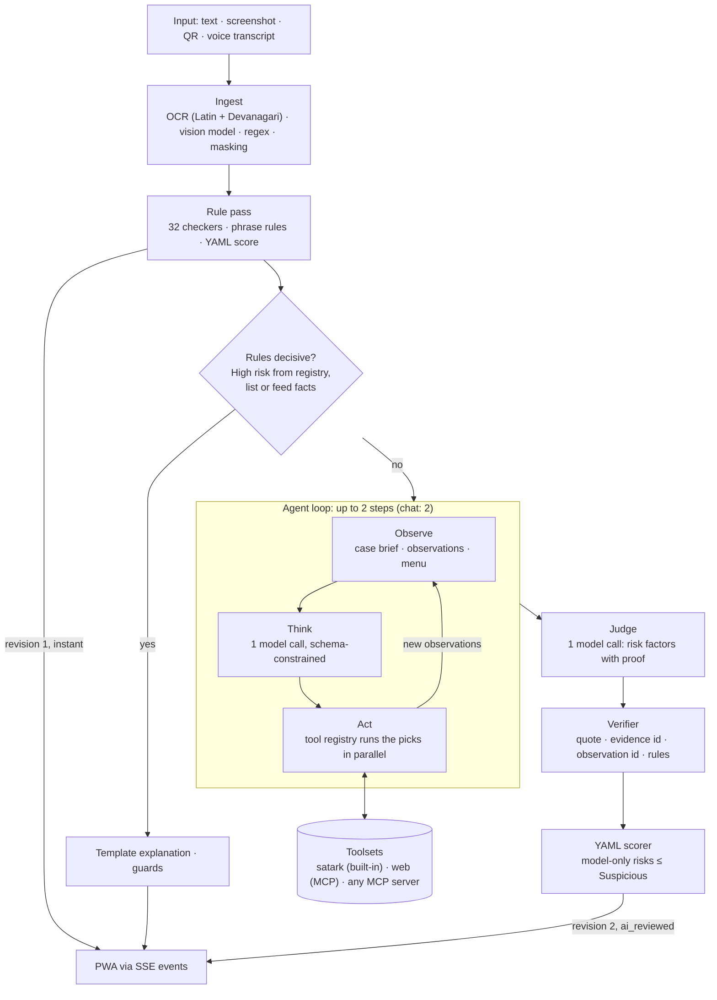
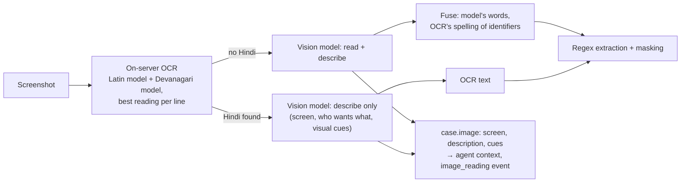
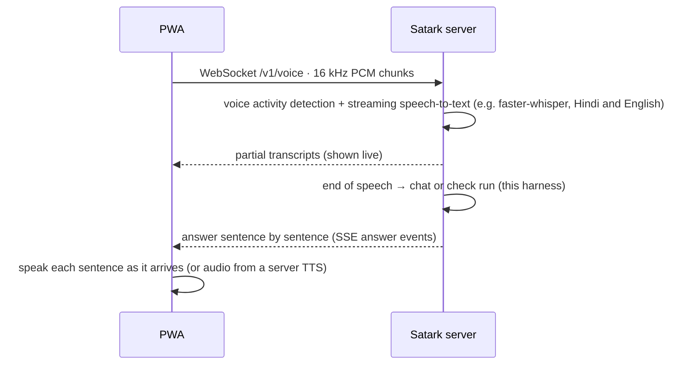

# Satark harness: how a check and a chat turn run

**TL;DR.** A request first gets an instant answer from deterministic rules. If the rules are decisive (High risk
proved by a registry or threat-feed fact) that answer stands. Otherwise an **agent loop** investigates:
1. A local model reads the case and picks lookups from a menu.
2. Satark runs those lookups through pluggable **MCP** (Model Context Protocol) tool servers: its own checks,
   SEBI's register, web search.
3. The model reads the results and either looks further or stops, within a budget of steps, calls and time.

A separate **judge** call then lists the risks with proof, a **verifier** drops anything unproven, and a fixed
rule table sets the level. Screenshots are read by on-server OCR (optical character recognition), including a
Hindi OCR model, together with a local vision-language model.

## 1. The flow



## 2. Route: when the rules are enough

The rule pass always runs first. It takes about 2 seconds and needs no model, so it is also the answer during a
model outage. The router (`satark/harness/orchestrator.py`) skips the model when the rules already proved
**High risk with Sure confidence**, which means a fact from a registry, an official list or a threat feed. This
saves cost and time on the clearest cases. Everything else goes to the loop. There is no keyword gate anywhere:
whether an input is a question, off-topic or a lesson is decided by two model calls that must agree.

## 3. The agent loop (observe → think → act)

`satark/harness/agent.py`. Each step is one model call whose output is constrained to a JSON schema built for that
step. Local models get the schema enforced while decoding, so a 3B model cannot return the wrong shape.

| Field | When present | Meaning |
|---|---|---|
| `thought` | always | One or two sentences: what is going on, what is still unknown (shown in the PWA timeline after a safety check) |
| `message_kind` | step 1 of a check | The model's first reading of the input; the judge must agree with it (§5) |
| `pick` | when the menu is not empty | Ids of suggested lookups to run now (`A1`, `A2`...), an enum: the model cannot invent a tool or an entity id |
| `web_search` | when a search tool is available | One search in the model's own words; placeholders such as `[URL_1]` are filled in by the harness |
| `add` | step 1, when `satark.add_and_check` is available | A name, app, handle or link the regex missed (exact words from the message); it is then checked |
| `done` | always | True when more lookups would not change the answer |

**Why a menu.** A 3B model, asked to write tool calls freely, returned no calls or invented entity ids ("cousin",
"Singapore"). Given a numbered menu of lookups the toolsets suggest, it picked sensible ones and still wrote its
own web query. A larger model gets the same menu and simply chooses better.

**Stop conditions and budgets** (`config/modes.yaml`, `config/tools.yaml`):

| Limit | Check | Chat |
|---|---|---|
| Steps | 2 | 2 |
| Tool calls per run | 6 (each tool also has its own cap) | 6 |
| Loop deadline | 35 s | 25 s |
| Step timeout | 20 s | 15 s |
| Stops early when | the model says done, picks nothing new, a step fails, or a budget runs out | same |

A step that fails (timeout, bad output after a retry) ends the loop. The judge still runs on everything gathered
so far, and if the judge fails too, the rule verdict stands. A lookup that was already made for this case is never
repeated, including across chat turns.

## 4. Tools: plug-and-play over MCP

`satark/harness/tools.py` puts every tool behind one interface: a spec (name, description, JSON input schema,
policy) and a call that returns text. Toolsets come from `config/tools.yaml`:

```yaml
toolsets:
  satark:  {kind: builtin, privacy: local}             # Satark's checks, SEBI register, safety notes
  web:                                                  # an MCP server over stdio
    kind: mcp_stdio
    command: ["{python}", "-m", "satark.mcp_servers.websearch"]
    privacy: external
    public_types: [url, domain, app.package, social.handle, tg.link, party.name]
    tools:
      search: {modes: [check, chat], max_calls: 2, suggest: {query: [domain, app.package, party.name]}}
```

- **Adding a server.** Add an entry with `kind: mcp_stdio` and its command, then restart. The server is spawned
  once, its tools are discovered with `tools/list`, and they appear in the loop's menu. A tool whose only
  required parameter is a string named like `query`, `url`, `domain` or `name` gets menu entries from the case's
  identifiers automatically. If a server fails to start, only its own tools disappear (see `GET /v1/meta` →
  `tools`).
- **Policy on every call.** Each call must pass four checks: the tool is allowed in this mode (check or chat),
  it is under its own cap and the run's total cap, and it finishes within its timeout. Results are masked,
  truncated and stored as observations (`obs1`, `obs2`...).
- **Privacy.** For a toolset marked `privacy: external`, placeholders of public identifier types (a site, an app,
  a firm's name) are filled in, every other placeholder is removed, and the PII (personally identifiable
  information) tripwire must pass. The user's phone, account, UPI ID or Aadhaar never reaches a search engine.
  The web-search server refuses personal-data-shaped queries on its own as well.
- **Satark as an MCP server.** `python -m satark.mcp_servers.satark_server` exposes `check_message`,
  `check_identifier` and `search_sebi_register` to any MCP client. For example, in Claude Desktop's
  `claude_desktop_config.json`:

  ```json
  {"mcpServers": {"satark": {"command": "uv", "args": ["--directory", "/path/to/satark", "run", "python",
    "-m", "satark.mcp_servers.satark_server"], "env": {"SATARK_LLM": "local:qwen2.5:3b-instruct"}}}}
  ```

## 5. Judge and verifier

`satark/harness/assess.py` makes one call that reads the brief, the check evidence (`ev` ids) and the
observations (`obs` ids). It returns the input's kind, a scam type, risk factors with proof, and a summary.
The verifier (`satark/harness/verify.py`) keeps a factor only when all of the following hold:

1. **Proof matches the code type.** A judgement code (fee to withdraw, OTP request, guaranteed return...) needs
   the message's exact words or an observation. A fact code (registry, domain age, `.bank.in`...) needs check
   evidence that carries that code.
2. **Both calls call it a message to check.** The loop's first step and the judge must both say so; a routine
   notice or a lesson cannot be flagged by its own wording.
3. **Not every contact is official.** If every UPI ID, number, app and site in the message checked out official,
   model-only claims do not count.
4. **Not a warning sentence.** A quote from a sentence like "never share your OTP" is a warning, not a request.

The YAML scorer then sets the level. Risks only the model found can raise it to **Suspicious** at most; **High
risk** needs a rule or a fact to agree.

## 6. Context and memory

`satark/harness/context.py` keeps every prompt inside the model's window (Ollama's default is 4,096 tokens).
Sections are trimmed in this order:
1. Older observations shrink to one line.
2. Clear check results drop out of the brief.
3. The oldest conversation turns go.

The newest observations, the message and the task line are never trimmed. The brief is rebuilt before every step,
so an identifier added mid-loop is shown masked.

Memory has two layers:
- **Within a check or chat:** observations are stored on the case, so a follow-up chat turn starts from what the
  check found and does not repeat a lookup.
- **Across cases:** nothing is kept. A case expires after 30 minutes, and nothing about the user is stored.

## 7. Screenshots



Measured on the test screenshots:
- **RapidOCR** spells identifiers exactly but glues words together ("UPlprofitking.desk@ybl").
- **The vision model** (`minicpm-v:8b`) reads layout and English wording well, but sometimes "corrects" letters
  inside identifiers (`profiting.kingdesk@ybl`), and reads Hindi poorly.
- **The Devanagari OCR model** (PaddleOCR PP-OCRv3, Apache-2.0, fetched by `scripts/get_ocr_models.sh`) makes Hindi
  screenshots readable on the server.

The vision role runs only when `SATARK_LLM_IMAGE` names a model: it is never inherited, because a screenshot can
show the user's own data.

## 8. Voice

**Built (in the PWA):**
- **Live transcript:** the words appear while the user is still speaking (the browser's speech recognition with
  interim results).
- **Progressive speech:** the instant verdict is read out at once, and if the AI review changes the level, a short
  update is read out.
- **Hands-free chat:** after an answer is spoken, the mic listens again. It stops on its button, after two silent
  turns, or when the tab is hidden.

**Designed, not built: server-side streaming speech.** This is for browsers without good Hindi recognition, and for
calls where the user cannot read the screen.



Audio would be processed in memory and never stored, the same rule as messages.

## 9. Compared with other agent harnesses

| | Claude Code | OpenAI Agents SDK | LangGraph | smolagents | Satark |
|---|---|---|---|---|---|
| Loop | model ↔ tool calls until no call | `Runner` loop, `max_turns` | state graph, recursion limit | step loop, `max_steps` | step loop with a schema per step, then a separate judge |
| Tools | built-in + MCP servers | function, hosted, MCP | ToolNode | tools, MCP collections | built-in + MCP servers from config, with a menu for small models |
| Guardrails | permissions, hooks | input/output guardrails | interrupts | — | PII tripwire, output guards, verifier, rule-table cap |
| Memory | conversation + compaction, CLAUDE.md | sessions | checkpointers | step memory | case observations (30 min), prompt fitting |

What Satark takes from them: a bounded loop with explicit stop conditions, MCP as the tool boundary, and guardrails
on input and output. What it adds for a safety product on a small local model: a menu-constrained step, a judge
separated from the investigation, and a verifier plus a fixed rule table, so the model can add evidence but never
decide the verdict alone.

## 10. Results

Measured numbers (blind message sets, the real-world online set, screenshots, latency) are in
[`TEST-REPORT.md`](TEST-REPORT.md) §4.

## Chat scope router and knowledge retrieval (Track C)

- **Scope**: `harness/scope_router.py` compares the message with example utterances per route in `config/routes.yaml`
  (money_or_scam_question, stock_tip_request, off_topic; English, Hindi, Hinglish) using fastembed
  `paraphrase-multilingual-MiniLM-L12-v2`. Rule: best example per route, argmax, top score >= 0.3, top two routes more than
  0.05 apart; otherwise (or with no encoder) the model's own `request` label is used. A confident off-topic or tip request
  gets the reviewed decline without a model call.
- **Knowledge**: `harness/knowledge.py` indexes FAQ answers, lesson steps and sims (BM25 + embeddings, reciprocal rank
  fusion). The top 4 chunks enter the answer prompt as K1..K4; `cites` in the reply are mapped back to chunk ids
  (`faq:<id>`, `lesson:<id>:<step>`, `sim:<id>`). No hit never causes a refusal. When the model step fails, the fallback
  answers from the FAQ, else the top chunk; "no risk signs found" is only used when a real verdict has reasons.
- The encoder loads once per process (`load_encoder`, cached, model files in `~/.cache/fastembed`) and runs in a thread.
- Chat web search results are limited to `chat_domains` in `config/tools.yaml`.
