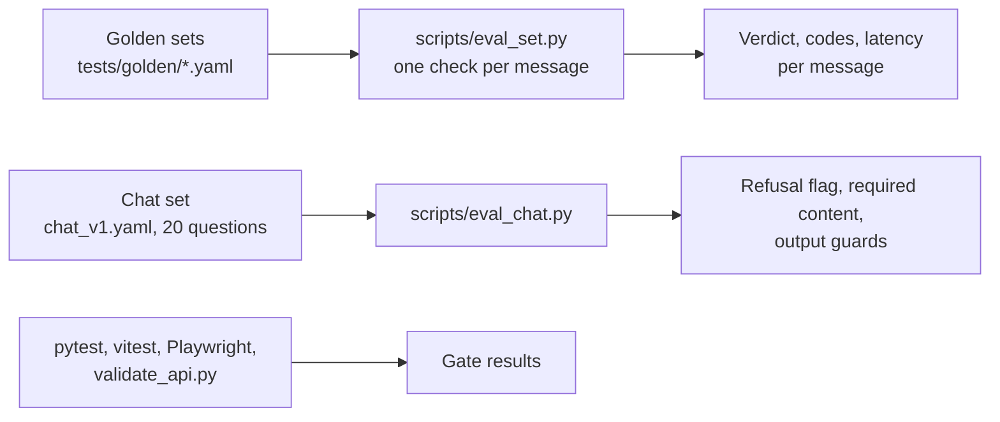

# Satark — test and review report

## TL;DR

Satark is ready for hands-on testing.
- Every automated gate passes: 890 Python tests, the web build, 52 web unit tests, and the end-to-end checks that were re-run (11 of the 36 browser specs, see §3).
- With the chosen local model (`qwen3:4b-instruct`), the AI review catches **32 of 36 scams on the blind set with 0 false alarms in 24 genuine messages**.
- The chat answers **18–20 of 20** scope questions correctly, up from 8–10. That covers answer what it should, refuse tips and off-topic requests.
- The weak spots:
  - **Speed:** a local AI review takes about 14 s (the rule verdict shows at once).
  - **News stories about scams:** only partly recognised as "about a scam".
- A hosted model would fix the speed for the public demo.

## 1. Scope

| Item | Value |
|---|---|
| Version | Working tree, staged tree `90affc23` (no commits), 4 Oct 2026 14:45 UTC |
| Data | Registry database `data_version` 8, built from the 3 Oct 2026 SEBI/NSE snapshots |
| Models | Text: `qwen3:4b-instruct-2507-q4_K_M`. Screenshots: `minicpm-v:8b`. Both run on Ollama, an RTX 4060 laptop GPU with 8 GB |
| Not covered | Screenshot accuracy after today's changes (last measured earlier). Web search on and off over a whole set. The full 36-spec browser suite after the last proof-panel change (§3). Load beyond one or two users |

Terms used below:
- **Scams caught:** the verdict is SUSPICIOUS or HIGH_RISK for a scam message.
- **False alarm:** the same verdicts for a genuine message.
- **Blind set:** messages nobody tuned rules or prompts on.

## 2. How it was tested

- **Accuracy runs:** network off, so they repeat exactly. Live lookups were tested separately with real and fake identifiers (§4.4).
- **Model ceiling:** a stand-in run with a hosted model (Claude Haiku, through an OpenAI-compatible shim) measured how much of the remaining error comes from the small local model.

## 3. Results by gate

| Gate | Command | Result |
|---|---|---|
| Python tests | `.venv/bin/python -m pytest -q` | ✅ 890 passed, 6 skipped |
| Web build (type-check + bundle) | `npm run build` in `web/` | ✅ clean; 110 KB gzipped JS+CSS (budget 150 KB) |
| Web unit tests | `npx vitest run` | ✅ 52 / 52 |
| Browser end-to-end | `npx playwright test` | ✅ 36 / 36 after the redesign. After the proof-panel change only the check and accessibility specs were re-run: 11 / 11 |
| API contract | `scripts/validate_api.py` | ✅ 60 / 60 (before the redesign; the API shape is unchanged since, apart from the added `proof` field) |
| Start scripts | `scripts/start.sh`, `scripts/dev.sh` | ✅ both serve the app |

## 4. Accuracy, honestly

### 4.1 Detection: models on the same code (network off)

| Set | qwen3:4b-instruct (**chosen**) | qwen2.5:3b-instruct | Before today (qwen2.5) |
|---|---|---|---|
| **Blind set 3** (36 scam / 24 genuine) | **32/36 caught · 0/24 false alarms** · 14 high risk | 31/36 · 2/24 · 8 high risk | 30/36 · 1/24 |
| Blind set 2 (rules were tuned on it) | 36/36 · 1/24 | not re-run | 36/36 · 4/24 |
| Online, real scam messages (13 scam / 7 genuine) | 8/13 · 0/7 | 7/13 · 0/7 | not separated |
| Online, news and awareness posts (40) marked "about a scam" | 9/40 | 11/40 | not measured |
| Median AI-review time per message | ~14 s | ~5.5 s | ~5.5 s |

Notes:
- Run-to-run variance at this model size is about ±4 messages out of 36. An earlier run of qwen3 on blind set 3 caught 36/36.
- **Model ceiling:** with Claude Haiku as the stand-in, 49 of the first 50 blind-set-3 messages were judged correctly. The remaining blind-set misses (mostly Hindi pig-butchering and crypto-airdrop messages) are a model-size limit, not a pipeline limit.
- **"About a scam" for news:** the 9/40 was measured before the judge got an explicit "is this text about a scam?" field. In a spot check after the change, 2 more of 6 news stories were marked, and 0 of 4 ordinary money explainers were wrongly marked. The full set was not re-run.

### 4.2 Chat (Track C), 20 questions

| Configuration | Passed | Notes |
|---|---|---|
| Before (model labels its own scope) | 8–10 / 20 | Refused real lessons ("What is a SIP?", "demat vs trading") as off-topic |
| Scope router + retrieval, qwen2.5:3b | 20 / 20 | |
| Scope router + retrieval, qwen3:4b | 18 / 20 | ch-08 fell back to a template, ch-17 missed the required words. The answer time limit has since been raised from 20 s to 30 s |

### 4.3 Rejected alternative

**IndicBERT-v2 scam classifier** (a ready-trained model for Indian languages, considered as an extra signal). It was measured on blind set 3 plus the online set in a research prototype that was not kept, because it was lost when the dev machine restarted. It caught 96% of scams but raised false alarms on 80% of genuine notices, so it was not added.

### 4.4 Live identifier checks (5 real or fake test messages, network on)

| Identifier | Source | Before | After |
|---|---|---|---|
| Company name ("Lazard…", an unknown firm) | SEBI register + web search | ❌ not extracted, no search | ✅ extracted as `party.name`, register and web searched, results cited |
| SEBI number + name | Registry snapshot | ✅ found; name mismatch → HIGH_RISK | same |
| Domain age | RDAP (Registration Data Access Protocol, the WHOIS successor), live | ✅ | same |
| Play Store app | Play listing, live | ✅ | same |
| UPI handle | Payment-app handle list (snapshot) | ✅ | same |
| Short link (bit.ly) | Unshorten, live | ⚠️ "Could not check": bit.ly sends an incomplete TLS (Transport Layer Security) certificate chain | same (open, see R-5) |
| Crypto address, international phone | Format rules only | ⚠️ no registry exists | same |

Every checklist row now carries proof, built in `satark/harness/proof.py` and shown by tapping a row in `web/src/components/Checklist.tsx`. A row shows:
- what was checked
- the source, with its snapshot date or "live"
- the one-line result
- a "verify yourself" link

A check that did not run shows "Could not check" with the reason, never a pass.

## 5. Findings fixed today

Severity follows the scale in the LLD: Critical > High > Medium > Low.

| # | Finding | Severity | Fix (where) |
|---|---|---|---|
| F-01 | The embedding model (about 0.5 GB) was reloaded for every runtime, so the test process grew to 4.5 GB and crashed WSL twice | High | Loaded once per process (`satark/harness/scope_router.py` `load_encoder`, `functools.cache`). Model cache moved out of `/tmp`. Router and knowledge index cached (`runtime.py`) |
| F-02 | The chat refused real money questions, because the 3B model labelled its own scope | High | Embedding scope router over example questions, falling back to the model when the top two scores are close (`scope_router.py`, `config/routes.yaml`) |
| F-03 | Company names in a message were never extracted, so no register or web search ran on them | High | `party.name` extraction and a forced company search in the agent loop (`extract/pipeline.py`, `agent.py`) |
| F-04 | News stories about a scam read "No strong risk signs found" | High | "About a scam" verdict variant with a lesson link (`orchestrator.py`, `VerdictCard.tsx`), plus the judge's `about_a_scam` field (`assess.py`) |
| F-05 | A risk the model found that is not in the catalogue could never reach SUSPICIOUS | Medium | `AI_RISK_PATTERN` weight raised to high; model-only verdicts are still capped at SUSPICIOUS (`config/signals.yaml`, `scoring.yaml`) |
| F-06 | The privacy tripwire blocked prompts after the model added an identifier, because observations were masked before it existed | Medium | Re-mask lookup results when building each prompt (`agent.py`, `respond.py`) |
| F-07 | A failed chat answer fell back to "No strong risk signs found" | Medium | Fall back to the best FAQ entry or retrieved lesson chunk instead (`respond.py`) |
| F-08 | Checklist rows showed no proof, and an unknown result looked like a pass | Medium | Proof object and expandable rows; "Could not check" with the reason (`proof.py`, `Checklist.tsx`) |
| F-09 | Lesson progress ✓ was lost (two writes raced) | Medium | Single write (`web/src/lib/idb.ts`, `LessonPlayer.tsx`) |
| F-10 | Chat citations were not rendered | Low | "Learn more: <lesson>" links (`Chat.tsx`) |
| F-11 | A simulation called PPF "a safe option" (guardrail: never say "safe") | Low | Reworded to "government-backed" (`content/sims/S2.json`) |
| F-12 | The agent's progress line showed in English in Hindi mode | Low | The step prompt asks for the user's language (`agent.py`) |
| F-13 | The online test set mixed news stories with real messages, which understated detection | Info | 27 items tagged `form: narrative` and 13 tagged `form: awareness`, scored separately (`tests/golden/online_v1.yaml`, `eval_set.py`) |

## 6. Open risks and next steps

| # | Risk | Severity | Next step |
|---|---|---|---|
| R-1 | **Latency and concurrency on one laptop GPU.** The AI review takes about 14 s for one user, and requests queue for several testers | Medium | For the public demo, use a hosted model for text roles. Keep screenshots on the local vision model. Masking already keeps identifiers out of prompts |
| R-2 | News and awareness posts are only partly marked "about a scam" | Medium | Re-measure with the new judge field; a hosted model is expected to do better |
| R-3 | Small-model variance of ±4 per 36 messages, with Hindi long-con scams most often missed | Medium | Hosted model, or a larger local model on a bigger GPU |
| R-4 | Screenshot accuracy not re-measured after today's changes | Low | Run `scripts/eval_screens.py` once |
| R-5 | bit.ly short links cannot be expanded (incomplete TLS chain) | Low | Bundle the missing intermediate certificate; never disable verification |
| R-6 | The public demo link is a temporary tunnel from the dev laptop | Low | Deploy as in `README.md` (Cloud Run) for a stable link |
| R-7 | Bhashini, Account Aggregator and IVR integrations are not built (open-track ideas, not required) | Info | Bhashini needs an API key; the voice features use the browser's speech engine today |

Where the raw results are

Eval logs and JSON live in `~/hackathon/eval-runs/`:
- `f3_*` is qwen3 and `f25_*` is qwen2.5.
- Screenshots are in `screens-v3/`.

Commands:
- `scripts/eval_set.py <set> --json out.json`
- `scripts/eval_chat.py`
- `scripts/eval_errors.py`

