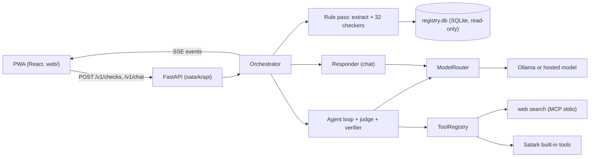
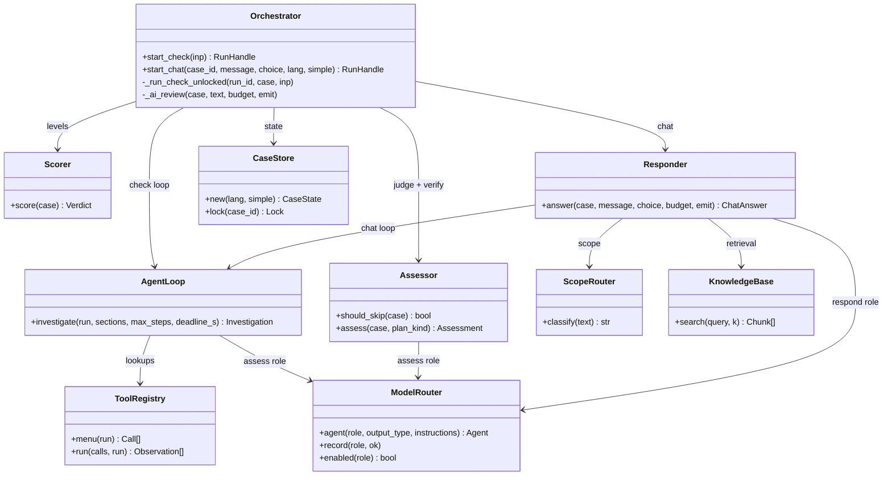
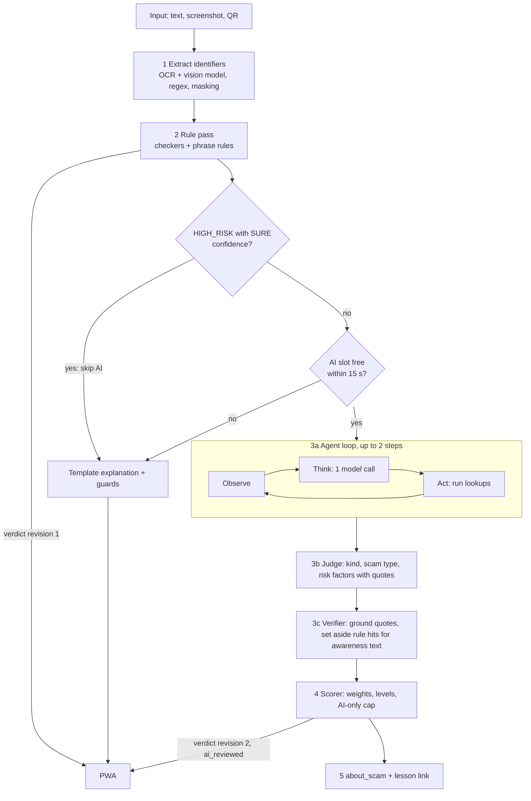
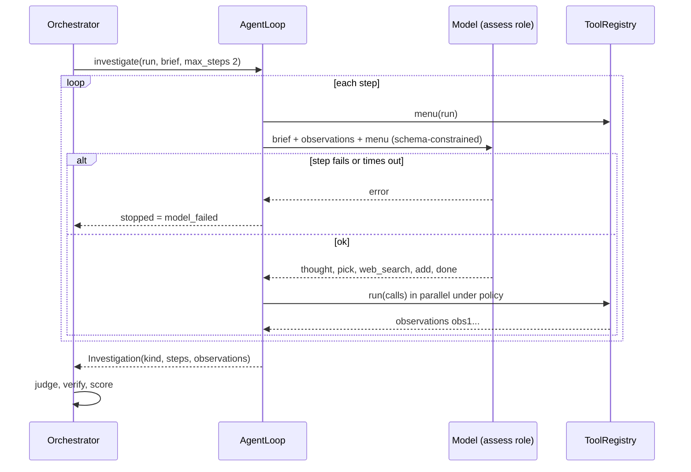
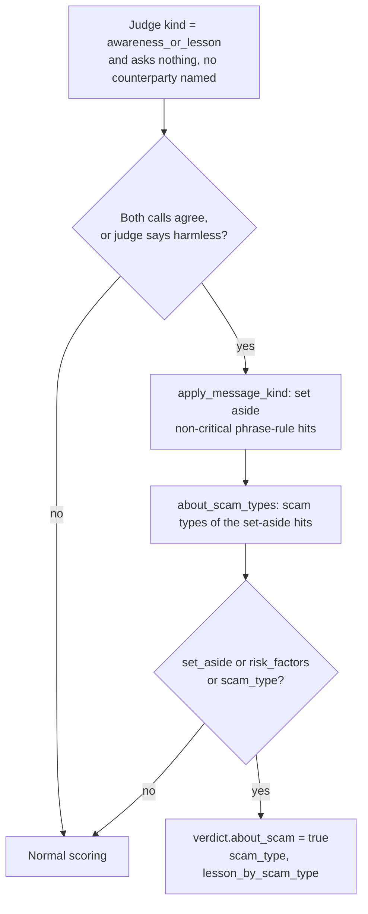
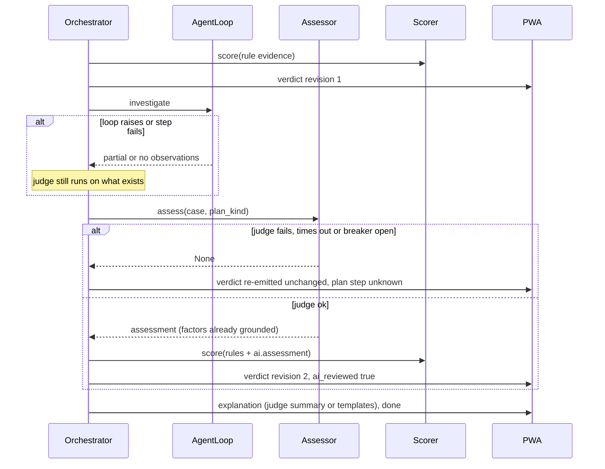
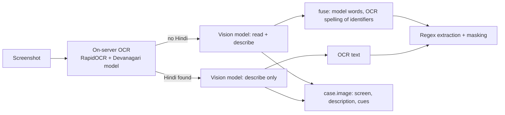
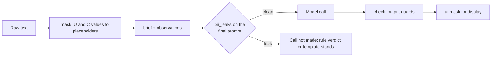
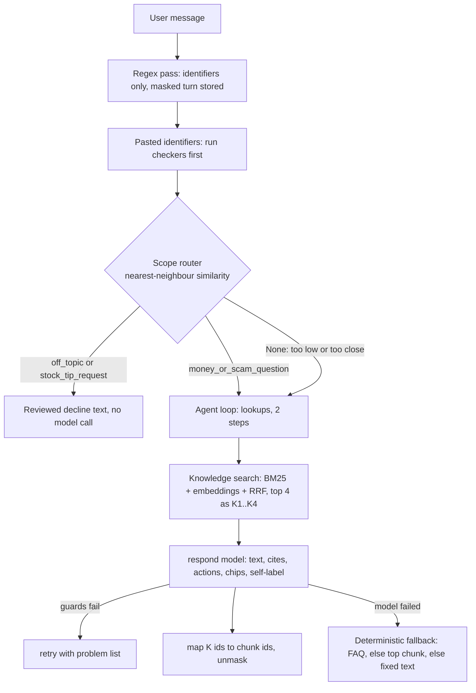
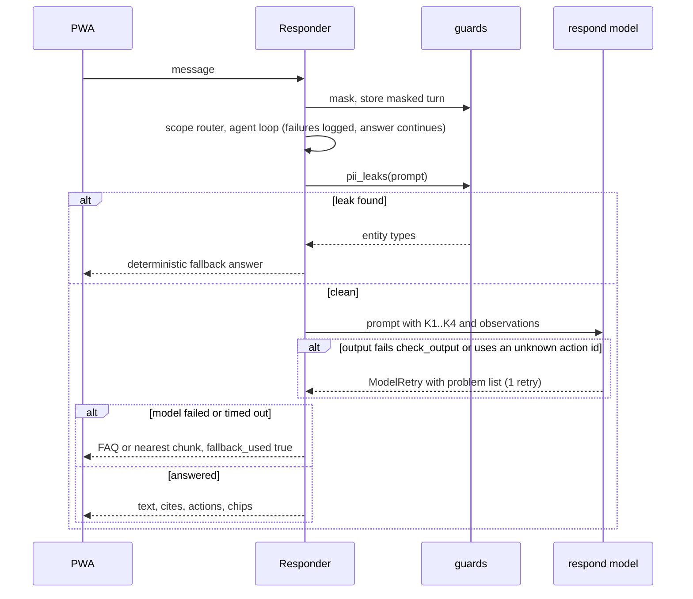

# Satark: Low-Level Design (LLD)

## TL;DR

Satark is a scam checker and learning app for first-time Indian investors. A check first gets an instant answer from deterministic rules (regex extraction, 32 checkers over SEBI/NSE registers and threat lists, phrase rules). A small local model then reviews it: an **agent loop** (observe, think, act) picks lookups, a **judge** names risks with quoted proof, a **verifier** drops anything unproven, and a YAML scorer sets the level. The model alone can never reach HIGH_RISK. The trickiest parts are the verifier (`satark/harness/verify.py`) and the privacy boundary (masking plus a tripwire before every outgoing prompt). Chat (Track C) adds a semantic scope router, retrieval over Satark's own lessons, and a teaching layer (lessons, simulations, quizzes, spaced re-test).

Terms used throughout, defined once:

| Term | Meaning |
|---|---|
| LLD / HLD | Low-Level / High-Level Design document. The HLD is `docs/reference/hld.txt`; this LLD says how it was built. |
| Harness | The code that wraps the model: it decides what the model sees, which tools it may call, and what its output is allowed to change. |
| Rule pass | The deterministic first stage: regex extraction, checkers and phrase rules, no model. About 2 s. |
| Case | In-memory state for one checked item or chat, kept 30 min (`satark/harness/cases.py:21`). |
| Entity | An identifier or claim found in the input (UPI ID, phone, link, "registered as ..."). Class U = user's own data (masked, value discarded), C = counterparty (masked for models), P = public (`config/entities.yaml:1`). |
| Evidence | One checker result stored on the case ledger (`ev1`...). |
| Observation | One tool result from the agent loop (`obs1`...). |
| SSE | Server-Sent Events: the one-way HTTP stream that carries a run's events to the browser. |
| MCP | Model Context Protocol, the standard way to plug external tools into a model harness. |
| PII | Personally identifiable information (phone, account number, UPI ID, Aadhaar). |
| RRF | Reciprocal rank fusion: merges two rankings by summing 1/(60+rank). |
| FSM | Finite-state machine: states plus choices that move between them. |
| PWA | Progressive web app: the installable React front end in `web/`. |

## Contents

1. [Scope and system map](#1-scope-and-system-map)
2. [Where to find X in the code](#2-where-to-find-x-in-the-code)
3. [Check flow](#3-check-flow)
4. [Model router and providers](#4-model-router-and-providers)
5. [Privacy](#5-privacy)
6. [MCP and tools](#6-mcp-and-tools)
7. [Chat (Track C)](#7-chat-track-c)
8. [Teaching (Track C)](#8-teaching-track-c)
9. [Backend around the harness](#9-backend-around-the-harness)
10. [Edge cases and error handling](#10-edge-cases-and-error-handling)
11. [Testing](#11-testing)
12. [Design decisions](#12-design-decisions)

## 1. Scope and system map

**In scope:** the harness, scorer, model routing, privacy, MCP, chat, teaching content and the backend as built on 4 Oct 2026. **Out of scope:** the HLD's product rationale, per-checker rules (see `config/*.yaml`), and numbers (see [TEST-REPORT.md](../TEST-REPORT.md)). **Interfaces** live in [CONTRACTS.md](../CONTRACTS.md); the harness narrative is [HARNESS.md](../HARNESS.md).

| Property | Statement | Evidence |
|---|---|---|
| Concurrency | One process, one worker; cases, event streams and rate limits are in memory. A run is an `asyncio` task; a per-case lock stops a check and a chat on the same case from mutating it together. At most 50 active runs. | `Dockerfile:66`, `satark/harness/orchestrator.py:32`, `:124` |
| Idempotency | Nothing is persisted per user. A retry is a new run. | `satark/harness/cases.py:21` |
| Model optional | With no `SATARK_LLM*` variable set, every role is off and the app runs deterministically (rules, template explanations, FAQ chat). | `satark/harness/models.py:7` |

### 1.1 Main classes

All are wired once at startup in `build_runtime` (`satark/harness/runtime.py:57`); the scope router and knowledge base share one embedding encoder (`runtime.py:88-91`).

## 2. Where to find X in the code

| Looking for | File (symbol) |
|---|---|
| Run lifecycle, routing, about-a-scam outcome | `satark/harness/orchestrator.py` (`_run_check_unlocked`, `_ai_review`) |
| Agent loop | `satark/harness/agent.py` (`AgentLoop.investigate`) |
| Tool registry, MCP client, policy | `satark/harness/tools.py` (`ToolRegistry`, `MCPToolset`) |
| Judge | `satark/harness/assess.py` (`Assessor.assess`, `Assessment`) |
| Verifier | `satark/harness/verify.py` (`ground`, `apply_message_kind`, `about_scam_types`) |
| Scorer | `satark/harness/score.py` + `config/scoring.yaml` |
| Model roles, providers, breaker | `satark/harness/models.py` + `config/models.yaml` |
| Masking, tripwire, output guards | `satark/harness/guards.py` |
| Prompt fitting | `satark/harness/context.py` (`fit`) |
| Screenshot reading | `satark/harness/vision.py`, `satark/harness/extract/ocr.py` |
| Chat | `satark/harness/respond.py` |
| Scope router | `satark/harness/scope_router.py` + `config/routes.yaml` |
| Retrieval | `satark/harness/knowledge.py` |
| Rule planner, executor, joiner | `satark/harness/plan.py`, `execute.py`, `join.py` |
| Checkers (32) | `satark/checkers/*.py`, signals in `config/signals.yaml` |
| Entity types (45) | `config/entities.yaml`, extraction in `satark/harness/extract/` |
| MCP servers | `satark/mcp_servers/websearch.py`, `satark_server.py` |
| Toolsets and web allowlist | `config/tools.yaml` |
| Limits and deadlines | `config/modes.yaml` |
| HTTP API, rate limits, errors | `satark/api/*.py` |
| Registry ingestion | `satark/ingest/` + `config/sources.yaml` |
| Runtime wiring | `satark/harness/runtime.py` (`build_runtime`) |
| Lessons, sims, FAQ | `content/lessons/*.json`, `content/sims/S1..S6.json`, `content/faq.json` |
| Spaced re-test | `web/src/lib/retest.ts` |
| Eval scripts and golden sets | `scripts/eval_*.py`, `tests/golden/*.yaml` |

## 3. Check flow

### 3.1 End to end

| Stage | What goes in | What happens | What comes out | Code |
|---|---|---|---|---|
| 1 Extract | text, image, QR | Screenshot: on-server OCR, then the vision model (section 4.4). Regex finds identifiers; each gets an entity id and a placeholder like `[UPI_1]`. | entities, `case.masked_text` | `orchestrator.py:129-190`, `satark/harness/extract/pipeline.py` |
| 2 Rule pass | entities | `RulePlanner` plans checker steps, `DagExecutor` runs them in waves (max 3), `Joiner` decides next wave, wait or finish. `Scorer.score` gives verdict revision 1. | evidence ledger, first verdict | `plan.py:17`, `execute.py:134`, `join.py:30`, `orchestrator.py:197-238` |
| 3 AI review | case brief, evidence | Skipped when rules proved HIGH_RISK with SURE confidence (`assess_skip_when_sure`) or no AI slot frees up in `ai_queue_wait_s`. | assessment or `None` (rule verdict stands) | `assess.py:119`, `orchestrator.py:240`, `:276` |
| 4 Score | all evidence | YAML levels, AI-only cap (section 3.5) | verdict revision 2 | `score.py:24` |
| 5 Outcome | verdict | news or awareness posts get `about_scam` (section 3.6) | card flag plus lesson id | `orchestrator.py:376-386` |

The rule pass always runs and always emits first, so a model outage costs time but never an answer. Whether an input is a question, off-topic or a lesson is decided by two model calls that must agree, not by a keyword gate (`guards.py:202` note; `orchestrator.py:342`).

### 3.2 Agent loop

`AgentLoop.investigate` (`agent.py:104`) runs up to `agent_steps` (2) steps. Each step is one model call whose output is constrained to a JSON schema built for that step (`agent.py:63`).

| Field | When | Meaning |
|---|---|---|
| `thought` | always | One or two sentences, shown in the PWA timeline |
| `message_kind` | step 1 | First reading of the input; the judge must agree (section 3.4) |
| `pick` | menu not empty | Menu ids (`A1`...) as an enum, so the model cannot invent a tool or entity id |
| `web_search` | search tool allowed | One query; placeholders are filled by the harness |
| `add` | step 1 | A name, app or handle the regex missed (max 2); it is then checked |
| `done` | always | True when more lookups would not change the answer |

Why a menu: a 3B model asked to write free tool calls returned none or invented entity ids; given numbered suggestions from the toolsets it picks sensibly (`tools.py:455`, `menu_size: 6` in `config/tools.yaml:7`).

The loop stops when the model says done, picks nothing new, a step fails (`model_failed`), the deadline is under 3 s, or steps run out (`agent.py:112-147`). A failed step ends the loop; the judge still runs on what was gathered.

### 3.3 Judge

`Assessor.assess` (`assess.py:125`) is one call that reads the masked brief, evidence ids (`ev1`...) and observation ids (`obs1`...). Output schema `Assessment` (`assess.py:55`):

| Field | Purpose |
|---|---|
| `sender`, `asks_reader_to`, `reasoning` | Reasoning-first fields in the order a careful reader works. A schema-constrained decoder writes them in order, so a small model answers easy questions first. |
| `message_kind` | `message_to_check`, `routine_notice`, `awareness_or_lesson`, `question` or `unrelated` (`assess.py:28`) |
| `scam_type` | `T1`..`T17` or null |
| `risk_factors` | At most 6, each `code`, `title`, `quote` (exact words, 120 chars), `evidence_ids` |
| `summary`, `chips` | At most 70 words for the user; 2-3 follow-up questions |

The judge's output validator is the verifier. Judge timeout is `judge_timeout_s: 25`, temperature 0 (`config/modes.yaml:5`, `config/models.yaml:11`).

### 3.4 Verifier

`verify.ground` (`verify.py:64`) keeps a factor only when all checks pass; each dropped factor produces a reason, and when every factor is dropped the model retries once with those reasons (`assess.py:141-150`).

| Rule | Behaviour | Code |
|---|---|---|
| Code must exist | Not a catalogue risk code and not `AI_RISK_PATTERN`: dropped | `verify.py:81` |
| Quote is grounded | Normalised quote (4+ chars) must appear in the masked message, or an observation id must back it | `verify.py:85` |
| Fact codes need evidence | Registry, domain age, `.bank.in` etc. are kept only if a cited check carries the same code | `verify.py:86-98` |
| Kind agreement | Quoted risks count only when both the loop's first reading and the judge say `message_to_check` (or awareness text that names a counterparty). Disagreement with a harmless first reading overrides the judge. | `verify.py:71`, `assess.py:141-146` |
| Not a warning sentence | Quote inside "never share your OTP" style spans is dropped | `verify.py:75`, `:101` |
| Not all-official contacts | If every UPI ID, number, app and site checked out official, quoted risks are dropped | `verify.py:132`, `:104` |
| Prose guards | Summary and titles go through `check_output`; a failure blanks the prose and templates explain instead | `assess.py:156-166` |

Kept factors become one evidence entry `ai.assessment`, family `ai`, basis `llm_claim` (`verify.py:140`). `apply_message_kind` (`verify.py:169`) sets aside phrase-rule evidence (status `skipped`, reason `ai_context:awareness_or_lesson`) when the text is awareness or news, never for critical phrases (OTP, remote access, fee to withdraw) and never when the text names a counterparty to pay or contact.

### 3.5 Scorer

`Scorer.score` (`score.py:24`) is pure: it reads evidence with status `hit`, takes each risk code once, and applies `config/scoring.yaml` (levels at `:5-9`).

| Item | Behaviour | Where |
|---|---|---|
| Weights | `critical`, `high`, `medium`, `low` per code in `config/signals.yaml` | `signals.yaml` |
| Levels | HIGH_RISK = 1 critical or 2 high; SUSPICIOUS = 1 high or 2 medium; NO_SIGNS needs a completed check; else UNKNOWN. First match wins. | `scoring.yaml:5-9`, `score.py:119` |
| AI-only cap | `ai_only_max_level: SUSPICIOUS`: if HIGH_RISK is decided only by codes found by `ai.assessment` (or about entities the model added), the level drops to SUSPICIOUS | `scoring.yaml:12`, `score.py:37`, `:107` |
| `AI_RISK_PATTERN` weight | `high`, so one verified AI-found risk reaches SUSPICIOUS on its own | `signals.yaml:98` |
| Actions | Up to 3, from defaults per level plus the top signals' actions | `scoring.yaml:15-24` |
| Scam type | Weighted vote over fired codes' `scam_types` | `score.py:175` |
| Lesson | `lesson_by_scam_type` maps `T1`..`T17` to a lesson id | `scoring.yaml:28-45` |

The model can add grounded evidence; it never sets or lowers the level.

### 3.6 About-a-scam outcome

A news item, awareness post or lesson that quotes scam phrases should not be flagged, but should link the matching lesson.

Code: `orchestrator.py:355-386`. The scam type comes from the judge or, failing that, from the most frequent type among set-aside hits (`verify.py:186`). The level stays (normally NO_SIGNS); the PWA shows an "about a scam" headline only when `about_scam` is true and level is NO_SIGNS (`web/src/components/VerdictCard.tsx:50`). The injection signal `INJECTION_TEXT` disables this path, so text that addresses the model cannot set rule findings aside (`orchestrator.py:343-345`).

### 3.7 Other judge outcomes

When nothing risky is found and both calls agree the input is a `question`, the check hands off to chat; `unrelated` yields an UNKNOWN verdict with an off-topic note (`orchestrator.py:347-352`, `:410-431`).

### 3.8 Rule pass in detail

| Piece | Behaviour | Code |
|---|---|---|
| Entities | 45 types in `config/entities.yaml`: each has regex patterns, normalise and validate functions, class U/C/P/R, a placeholder prefix and a per-case cap. Claims (for example "registered as ... number ...") are found by rules, not a model, when the AI review is on. | `config/entities.yaml`, `satark/harness/extract/pipeline.py` |
| Checkers | 32 plugins, each declaring an id, a family, the entity types it consumes and the signal codes it produces | `satark/checkers/base.py:61` |
| Checker families | app 3, registry 7 (SEBI registers, caution list, debarred, name scan), text 4 (red flags, return math, claims, notices), payment 5 (UPI validity, PSP, collect, QR, crypto), link 9 (blocklist, lookalike, domain age by RDAP, unshorten, official, popularity, APK, Google-hosted, domain rules), phone 3, social 1 | `satark/checkers/*.py` |
| Planner | `RulePlanner` plans one step per (checker, entity) not already in the ledger, filtered by the mode's `allow_privacy` | `plan.py:22` |
| Executor | Runs a wave concurrently with per-checker timeouts and retries, a circuit breaker (5 failures opens it for 30 s), rate limits and a result cache; yields evidence as each finishes | `execute.py:24-25`, `:134` |
| Joiner | After each wave: FINISH when budget is out, max 3 waves, or the preview is HIGH_RISK, SURE with 3 reasons; NEXT_WAVE when a derived entity is unplanned; WAIT_EXTRACTION; ASK_USER on an ambiguous match | `join.py:30-50` |
| Signals | A checker result carries signal codes with polarity (risk, assurance, info, flag), weight, scam types and an optional simulator, all in `config/signals.yaml` | `config/signals.yaml` |
| Phrase rules | `text.redflags` matches the lexicon in `config/lexicons/redflags.yaml`; matches inside warning sentences ("never share your OTP") do not count | `satark/checkers/text.py`, `verify.py:75` |

### 3.9 Error path of the AI review

Code: `orchestrator.py:331-332` (loop failure is logged and tolerated), `:306` (`give_up`), `:339-340` (judge failure).

## 4. Model router and providers

### 4.1 Roles

`ModelRouter` (`models.py:77`) maps a role to a PydanticAI model or a fallback chain. Settings per role are in `config/models.yaml`.

| Role | Used by | Timeout | Notes |
|---|---|---|---|
| `extract` | optional LLM extraction | 6 s | Skipped when the AI review is on |
| `assess` | agent loop steps and judge | 40 s total, step 20 s, context 3,200 tokens | temperature 0 |
| `explain` | explainer | 4 s | |
| `respond` | chat | 20 s, step 15 s | temperature 0.2 |
| `image` | screenshot reading | 45 s | Only used when `SATARK_LLM_IMAGE` names a model; never inherited from `SATARK_LLM` (`models.py:35`) |

### 4.2 Providers and output mode

| Setting | Behaviour | Code |
|---|---|---|
| `SATARK_LLM=local:<model>` | Any OpenAI-compatible server (Ollama default `http://127.0.0.1:11434/v1`) | `models.py:62-70` |
| `anthropic:`, `google-gla:`, `vertex-claude:` | Hosted providers via PydanticAI | `models.py:54-62`, `:72` |
| Comma list | Fallback chain via `FallbackModel` | `models.py:96` |
| Output mode | `native` for `local:` (JSON schema enforced while decoding), `tool` for hosted, `prompted` on request. In native mode a field guide is appended to the instructions because the model never sees the schema. | `models.py:153-175` |

Native output exists because in prompted mode the 3B model echoed the schema back and in tool mode returned empty replies (TEST-REPORT F-25).

### 4.3 Models and defaults

| Role | Local model | Notes |
|---|---|---|
| Text roles (loop, judge, chat) | Ollama text model. The default is being chosen between `qwen2.5:3b-instruct` and `qwen3:4b-instruct`; see [TEST-REPORT.md](../TEST-REPORT.md) for the chosen default. | `SATARK_LLM=local:<model>` |
| Screenshots | `minicpm-v:8b` | `SATARK_LLM_IMAGE=local:minicpm-v:8b` |

### 4.4 Breaker and cost cap

| Mechanism | Behaviour | Code |
|---|---|---|
| Circuit breaker | After `breaker_failures: 3` consecutive failures a role is skipped for `breaker_pause_s: 60`; one success resets the counter. During an outage users get the rule verdict at once instead of waiting for model timeouts. | `models.py:137-150`, `config/models.yaml:20` |
| Cost cap | Per-day USD estimate from `prices_usd_per_mtok`; over `daily_cost_cap_usd: 20` all roles read as off | `models.py:187-198` |
| Status | `GET /v1/meta` reports each role as on or the reason it is off | `models.py:199` |
| AI concurrency | `ai_concurrency: 2` reviews at once (a local GPU serves one call at a time); waiting longer than `ai_queue_wait_s: 15` falls back to the rule verdict | `config/modes.yaml:9-11`, `orchestrator.py:276` |

### 4.5 Screenshots (vision)

| Fact | Detail | Code |
|---|---|---|
| Why two readers | OCR copies identifiers exactly but glues words; the vision model reads layout and wording but can "correct" letters inside identifiers | `vision.py:1-13` |
| Fusion | Identifiers with a near twin in OCR text take the OCR spelling | `vision.py:108` |
| Hindi shortcut | When OCR found Devanagari, the model only describes (`ImageGist`), which is several times faster | `vision.py:55`, `orchestrator.py:158` |
| Failure | Model error or timeout: OCR text alone carries the check | `vision.py:63-68` |
| Description is masked | Description and cues are masked after identifiers are known, then unmasked for display | `orchestrator.py:180-187` |

## 5. Privacy

Raw user data must never reach a model, a search engine or a log. Three layers:

| Layer | Behaviour | Code |
|---|---|---|
| Masking | Every U and C entity's value and display text is replaced by its placeholder, longest first. A U-class regex rescan masks new OTPs or Aadhaar numbers a chat turn introduces. Placeholders are `[UPI_1]`, `[PHONE_2]`... | `guards.py:90`, `:59` |
| Unmasking | C placeholders become the user's own text for display; U placeholders become "(hidden)" (Hindi: localized) | `guards.py:112` |
| PII tripwire | `pii_leaks(prompt, case)` returns the entity type names (never values) of any raw U or C value found in the outgoing prompt, plus a U-class regex scan. On a leak the call is not made. Run before the judge, the chat answer, and every external tool call. | `guards.py:176`, `assess.py:173`, `respond.py:266`, `tools.py:345` |
| Output guards | `check_output` rejects model prose with: code mismatch, tips ("buy X"), code markup, ungrounded figures, "this is safe" affirmations, wrong script, over length. Chat retries with the problem list; the judge blanks the prose and uses templates. | `guards.py:268`, `respond.py:244-250`, `assess.py:156-166` |
| External tools | For `privacy: external` toolsets only placeholders of public types are filled in; other placeholders are removed and the tripwire must pass | `tools.py:327-347`, `config/tools.yaml:35` |
| Screenshots | Read on-server (OCR) by default; the image goes only to a model explicitly named for the `image` role | `models.py:35`, `orchestrator.py:166-170` |
| Logs | Access log allowlist: path template, status, latency, never run id or IP; exception logs keep type and code locations only | `app.py:47`, `:110` |
| Retention | Cases expire after 30 min; events kept 5 min after a run; nothing is stored per user | `cases.py:21`, `events.py:21` |

## 6. MCP and tools

`ToolRegistry` (`tools.py:402`) puts every tool behind one interface (spec: name, description, input schema, policy; call returns text). Toolsets come from `config/tools.yaml`.

| Toolset | Kind | Tools | Privacy |
|---|---|---|---|
| `satark` | builtin (`SatarkTools`, `tools.py:126`) | `check_identifiers` (2 calls), `add_and_check` (3), `search_sebi_register` (2), `read_safety_note` (chat only, 2) | local |
| `web` | `mcp_stdio` (`MCPToolset`, `tools.py:253`) | `search` (2 calls) | external: only types in `public_types` leave |

**Policy per call** (`tools.py:442-453`): allowed in this mode (check or chat), under the tool's own cap and the run total (`max_calls_per_run: 6`, `config/tools.yaml:6`), within its timeout (web 12 s). Results are masked, truncated and stored as observations. Note `modes.yaml` also carries `tool_calls` (24 check, 8 chat) for the older budget; the registry cap of 6 is the binding one.

**Adding a server:** add a `kind: mcp_stdio` entry with its command and restart. The registry spawns it once, discovers tools with `tools/list` (`tools.py:273`), and builds menu entries from case identifiers for tools whose only required parameter is a string named like `query`, `url`, `domain` or `name`. A server that fails to start only removes its own tools (`GET /v1/meta` shows status).

| MCP server | Command | Behaviour | Code |
|---|---|---|---|
| Web search | `python -m satark.mcp_servers.websearch` | One tool `search`. Backend `ddgs` (DuckDuckGo) or `fake` (tests). Refuses queries shaped like email, UPI ID, 10+ digit numbers, Aadhaar, PAN. Cache 1 h, max 256 entries. Off when `SATARK_OFFLINE=1`. | `websearch.py:40`, `:33`, `:132` |
| Satark as a server | `python -m satark.mcp_servers.satark_server` | Exposes `check_message`, `check_identifier`, `search_sebi_register` to any MCP client (for example Claude Desktop) | `satark_server.py:84`, `:93`, `:101` |

Defence in depth: the harness removes personal placeholders before the call, and the search server independently refuses personal-data-shaped queries.

## 7. Chat (Track C)

`Responder.answer` (`respond.py:152`) handles a chat turn, either from `POST /v1/chat` or a handoff from a check.

### 7.1 Scope router

`ScopeRouter` (`scope_router.py:63`) replaces asking the chat model to label its own request: a 3B model refused real money questions as off-topic and missed stock-tip requests because the label and the reply come from the same small forward pass.

| Step | Behaviour |
|---|---|
| Examples | About 15-30 utterances per route in English, Hindi and Hinglish in `config/routes.yaml` (routes: `money_or_scam_question`, `stock_tip_request`, `off_topic`). Never copied from `tests/golden/chat_v1.yaml`, so the router is not scored on its own examples. |
| Encoder | fastembed `paraphrase-multilingual-MiniLM-L12-v2`, loaded once per process, cached in `~/.cache/fastembed` (`scope_router.py:40`) |
| Decision | Per route, the single closest example (not an average); argmax over routes. Returns `None` when the top score is below 0.3 or the top two routes differ by less than 0.05 (`scope_router.py:81-97`). |
| `None` | Falls back to the model's own `request` label (`respond.py:215-218`) |
| Pattern | The topical-rail idea from NVIDIA NeMo Guardrails and aurelio-labs semantic-router |
| Effect | A confident decline gets the reviewed text in the user's language with no model call; a confident money route adds "answer this yourself, do not decline" to the prompt and overrules a stray model self-label (`respond.py:219-221`, `:255-257`, `:273-274`) |

### 7.2 Knowledge retrieval

`KnowledgeBase` (`knowledge.py:100`) indexes one chunk per FAQ answer, lesson step and simulation summary (`content/faq.json`, `content/lessons`, `content/sims`).

| Step | Behaviour | Code |
|---|---|---|
| Rankers | BM25 (`rank_bm25`) and cosine similarity over the same encoder as the router | `knowledge.py:108-127` |
| Fusion | RRF with constant 60: score = sum of 1/(60+rank) across both lists, no weight to tune | `knowledge.py:29`, `:137` |
| Prompt | Top 4 chunks enter as `K1..K4`; with no hit the prompt says to use general investing-safety knowledge, and that is not a reason to decline | `respond.py:258-261`, `:293-305` |
| Citations | The model's `cites` (K ids) are mapped back to chunk ids `faq:<id>`, `lesson:<id>:<step>`, `sim:<id>` for the PWA's "Learn more" links | `respond.py:280` |
| Off the event loop | Embedding is CPU work, so `search_async` runs in a thread | `knowledge.py:163` |

### 7.3 Web search and fallbacks

| Topic | Behaviour | Code |
|---|---|---|
| Domain allowlist | In chat, web results are filtered to `chat_domains` (sebi.gov.in, rbi.org.in, cybercrime.gov.in, pib.gov.in, nism.ac.in, amfiindia.com, npci.org.in, incometax.gov.in, sancharsaathi.gov.in) so a reply points only to official sources. Checks may use any result, to spot scam sites. | `config/tools.yaml:28`, `tools.py:358-367` |
| Model step fails | `_deterministic_answer`: checker results for pasted identifiers, else the FAQ intent, else the nearest knowledge chunk, else the fixed fallback text. `fallback_used` is set when a model was configured but not used. | `respond.py:171-175`, `:372-406` |
| Tripwire fires | Answer is dropped and the fallback runs | `respond.py:266-269` |
| "No risk signs found" | Used only when a real verdict has reasons | HARNESS.md chat section |
| Decline vs refusal codes | `request` self-label values map to `refused: off_topic` or `advice` in the `answer` event | `respond.py:79` |

### 7.4 Chat error path

Code: `respond.py:152-181`, `:203-281`, `:372-406`. A model that self-labels a request as off-topic or a tip request gets the reviewed decline instead of its own words, because a 3B model asked to decline still told the joke (`respond.py:283-291`).

## 8. Teaching (Track C)

All teaching content is static JSON in `content/`, bundled into the PWA at build time; no model is involved in lessons, simulations or quizzes (`web/src/routes/SimPlayer.tsx:1`).

| Piece | What it is | Code |
|---|---|---|
| Lesson | 12 files: `title`, `tactic` (prebunking banner), `tacticKey`, `steps` (about 5), `analogy`, `source` (official URL), `sim` (linked simulator id), `quiz` | `content/lessons/*.json`, `web/src/lib/lessons.ts:31` |
| Tactic banner | Prebunking: the lesson's first step shows the manipulation tactic before the learner meets it in the wild | `web/src/routes/LessonPlayer.tsx:56-60` |
| Source link | The last step links the official source in `lesson.source` | `LessonPlayer.tsx:77` |
| Sim link | A lesson's `sim` opens `/sim/<id>`; the verdict card also offers the simulator chosen by the top signal (`signals.yaml` `simulator`) | `score.py:182` |
| Quiz | One or two to three questions per lesson or sim: `question`, `options` (one `correct`), `explain`, optional `tactic` key | `lessons.ts:14-44`, `QuizFlow.tsx` |
| Lesson for a verdict | `lesson_by_scam_type` (section 3.5) puts the lesson id on the verdict | `scoring.yaml:28` |

### 8.1 Simulations S1 to S6

| Id | Kind | Scenario |
|---|---|---|
| S1 | `fsm` | Fake trading-app trap (9 states) |
| S2 | `returns` | "Guaranteed return" calculator (rate, period; pre-filled from the verdict's `sim_params`) |
| S3 | `leverage` | Leverage wipe-out; seeded random walk, deterministic per seed (`web/src/lib/sim/s3.ts:6`) |
| S4 | `fsm` | Fake "digital arrest" call (7 states) |
| S5 | `fsm` | Part-time job that asks you to pay (7 states) |
| S6 | `fsm` | "KYC update" call that wants remote access (7 states) |

An FSM sim has `start`, `vars` and `states`; each state has `say` text and `choices` that name the next state (`content/sims/S1.json`). One generic engine runs S1 and S4-S6 (`web/src/lib/sim/s1.ts:3`, `:66-69`); a choice naming an unknown state stays on the current one. Text is bilingual (`en`, `hi`).

### 8.2 Spaced re-test

A single practice session does not hold up, so a missed tactic is re-probed later (`web/src/lib/retest.ts:1`).

| Step | Behaviour | Code |
|---|---|---|
| Record | Wrong answer to a tagged question stores its `tactic` key in `localStorage` (`missed_tactics`) | `retest.ts:28`, `QuizFlow.tsx:41` |
| Clear | A right answer on a tagged question removes it | `retest.ts:35` |
| Re-test | On a later Learn visit, `getQuickCheck()` returns one question from the pool of all tagged questions across lessons and sims for the earliest still-missed tactic | `retest.ts:60` |
| Storage failure | Private mode or quota errors are swallowed; the re-test simply does nothing that session | `retest.ts:11-25` |

Progress and history use IndexedDB (`web/src/lib/idb.ts`); only the missed-tactics list is in `localStorage`.

## 9. Backend around the harness

### 9.1 API summary

Full request and response shapes, error table and every SSE payload are in [CONTRACTS.md](../CONTRACTS.md) section 6. Summary:

| Endpoint | Purpose | Code |
|---|---|---|
| `POST /v1/checks` | Multipart text, image (JPEG, PNG, WebP up to 2 MB), QR, lang; returns 202 with `run_id`, `case_id`, `events_url` | `api/checks.py:36` |
| `GET /v1/runs/{run_id}/events` | SSE stream, replay with `Last-Event-ID`, ping every 10 s | `api/runs.py:59` |
| `POST /v1/chat` | Message or choice, optional `case_id` | `api/chat.py:32` |
| `POST /v1/report-draft` | Complaint text and portals for a case | `api/report.py:28` |
| `GET /v1/meta`, `/healthz`, `/readyz` | Sources, languages, disabled checkers, role status | `api/meta.py:13`, `:49`, `:54` |
| `POST /v1/feedback`, `POST /share` | Helpful or mistake; share-target fallback | `api/feedback.py:24`, `api/share.py:18` |

Event order per check: `stage` events, `entities`, `plan`, `check_result`*, `verdict` (revision 1), `agent_step`*, `tool_status`*, `verdict` (revision 2, `ai_reviewed`), `explanation`, `done` last. A case is returned with the 202, so the PWA can start chat on it.

### 9.2 Data model

**Runtime (in memory, Pydantic):** `CaseState` holds `entities`, evidence `ledger`, `plan`, `verdict`, `explanation`, chat `turns` (masked), `observations`, `image` and a pending `question` (`harness/state.py:216`). `Verdict` carries `level`, `confidence`, `reasons`, `scam_type`, `simulator`, `lesson`, `about_scam`, `ai_reviewed` (`state.py:136`).

**Registry (SQLite, read-only at runtime):** opened with `mode=ro` (`infra/db.py:21`); schema in `satark/ingest/schema.sql`.

| Table | Holds |
|---|---|
| `intermediary` (+ FTS5 `intermediary_fts`) | SEBI registers: advisers, analysts, brokers; name, registration number |
| `caution_entry`, `debarred` | SEBI caution notices and debarred persons (PAN stored as SHA-256) |
| `blocklist_domain`, `official_domain`, `app_registry`, `social_handle` | Threat lists and official identifiers |
| `popularity`, `psp_handle`, `listed_security` | Domain rank, UPI handle owners, NSE listed securities |
| `meta`, `ingest_run` | Build metadata and per-source run history |

### 9.3 Ingestion

`python -m satark.ingest` builds `data/registry.db` from snapshots in `data/manual/` (`--fetch` pulls threat feeds first; `--only <source>` rebuilds one).

| Step | Behaviour | Code |
|---|---|---|
| Gate | Each source must pass: key pattern matches at least 99% of rows, row count above `min_rows` and not down more than `max_drop_pct`, `as_on` not older than last good run | `ingest/gate.py:46`, `config/sources.yaml:23` |
| Failure | The source keeps its previous rows (`kept_previous`); a table is never emptied | `ingest/gate.py:1-10` |
| Swap | Build to `registry.next.db`, rebuild FTS5, `ANALYZE`, `integrity_check`, then atomic `os.replace` | `ingest/__main__.py:235` |
| Staleness | A source older than `max_age_days` marks evidence `stale` and surfaces as such | `config/sources.yaml:24`, `state.py:100` |

### 9.4 Deployment

Single Docker image, three stages (`Dockerfile`): build the PWA (Node 22), build `registry.db` (`--fetch`, falling back to offline), then a Python 3.12 runtime running `uvicorn satark.app:create_app --factory --workers 1` as a non-root user on `$PORT` (default 8080) (`Dockerfile:1-66`). `--build-arg INSTALL_OCR=true` adds RapidOCR and the Devanagari model (`scripts/get_ocr_models.sh`). One worker is deliberate: cases, streams and rate limits are process memory.

| Variable | Effect |
|---|---|
| `SATARK_LLM`, `SATARK_LLM_<ROLE>`, `SATARK_LLM_BASE_URL`, `SATARK_LLM_OUTPUT_MODE` | Model per role (`models.py:7-12`) |
| `SATARK_LLM_IMAGE` | Enables screenshot reading by a vision model |
| `SATARK_OFFLINE=1` | No network tools |
| `SATARK_DB`, `SATARK_ROOT`, `SATARK_WEB_DIST` | Paths (`config.py`, `app.py`) |

### 9.5 Observability

| Signal | How | Code |
|---|---|---|
| Structured logs | JSON lines with an allowlist of keys; never message text, identifiers or IPs | `app.py:47-80` |
| Access log | Path template, status, latency | `app.py:110` |
| Run trace | Per-case agent trace (steps, stop reason, lookup count, factors kept and dropped; counts only, no text) kept until the `done` event and attached to it | `orchestrator.py:329`, `:365`, `:271` |
| Timings | `done` event carries `extract_ms`, `verify_ms`, `verdict_ms`, `explain_ms` | `orchestrator.py:501` |
| Model health | `/v1/meta` role status, breaker state, `PII_TRIPWIRE` warnings | `models.py:199` |

### 9.6 Limits and deadlines

Config: `config/modes.yaml`, `config/tools.yaml`, `config/models.yaml`.

| Limit | Check | Chat |
|---|---|---|
| Verdict deadline (rules) / run deadline | 9 s / 12 s | n/a / 15 s |
| Agent steps | 2 | 2 |
| Agent loop deadline | 35 s | 25 s |
| Step timeout (model) | 20 s | 15 s |
| Judge timeout | 25 s | n/a |
| Tool calls per run | 6 (registry), per-tool caps 2-3 | 6 |
| Concurrent AI reviews / queue wait | 2 / 15 s | n/a |
| Active runs | 50, then 503 `busy` | same |
| Body size | 2.5 MB | same |
| Rate limits per IP per minute | checks 10, events 30, chat 20, report 10, feedback 10 | |
| Case TTL | 30 min | same |

Rate limits and body cap: `api/limits.py:19`, `:110`. `SATARK_RATE_LIMIT_SCALE` scales or disables them for load runs.

### 9.7 Configuration files

Behaviour is configuration where possible; link, do not copy.

| File | Controls |
|---|---|
| `config/scoring.yaml` | Weights, levels, AI-only cap, default actions, `lesson_by_scam_type` |
| `config/signals.yaml` | Signal codes: polarity, weight, scam types, simulator, suppression |
| `config/models.yaml` | Role timeouts, tokens, temperature, context, breaker, cost cap |
| `config/modes.yaml` | Check and chat limits, AI concurrency, skip-when-sure |
| `config/tools.yaml` | Toolsets, caps, MCP command, public types, chat domain allowlist |
| `config/routes.yaml` | Scope router example utterances |
| `config/entities.yaml`, `claim_rules.yaml`, `brands.yaml` | Extraction patterns, claim rules, brand impersonation |
| `config/sources.yaml` | Registry sources, ingest gates, max age |
| `config/lexicons/` | Phrase rules (`redflags.yaml`) and output guard lists (`guards.yaml`) |
| `config/link_rules.yaml`, `phone_rules.yaml`, `languages.yaml` | Link and phone rules, enabled languages |

Startup loads everything through `satark/config.py:59` (`Config`).

## 10. Edge cases and error handling

| Condition | Behaviour | Shown to user as |
|---|---|---|
| No model configured | Deterministic mode: rules, templates, FAQ chat | Rule verdict; no AI badge |
| Model timeout or bad JSON | One retry (verifier retries once on all-dropped factors); then rule verdict stands | Verdict revision 1 stays; `fallback_used` on chat |
| Repeated model failures | Breaker skips the role for 60 s | Rule verdict immediately |
| AI queue full | Skip AI after `ai_queue_wait_s` | Rule verdict |
| Rules proved HIGH_RISK (SURE) | AI skipped, template explanation | Verdict at once |
| Loop step fails | Loop ends; judge runs on what was gathered | Normal AI review |
| Judge fails | `give_up`: plan step marked unknown, verdict re-emitted | Rule verdict |
| Verifier drops every factor | One retry with reasons; then no AI-found risk | Rules decide |
| Prose fails guards | Summary blanked; template explanation | Template text |
| PII tripwire fires | Model call not made; log shows entity types only | Rule verdict or chat fallback |
| Search server down | Its tools disappear from the menu | Loop uses remaining tools |
| Input is injection text | `INJECTION_TEXT` signal; model's kind reading cannot reroute or set rules aside | Scored by rules |
| Empty or oversize input | 422 `nothing_to_check`, 413 `input_too_large` | Localized error message |
| Case expired (30 min) | 404 `case_expired` | Prompt to restart |
| Too many runs / rate limit | 503 `busy`, 429 `rate_limited` with `Retry-After` | Retry message |
| Unhandled exception in a run | SSE `error` event with `retryable: true` | Localized error |
| Check and chat on one case | Per-case lock serializes them | Transparent |
| Reconnect mid-run | SSE replay with `Last-Event-ID` for 5 min after end | Seamless |
| Daily cost cap reached | All model roles off | Rule verdict |
| Registry source stale | Evidence marked `stale` | "Data as on" shown |

Error body shape is `{"error": {"code", "message_key", "retryable"}}` for every non-2xx response (`api/errors.py:41`).

## 11. Testing

| Layer | What | Where |
|---|---|---|
| Unit and property | Extraction, checkers, scorer, guards, agent loop, judge with scripted models | `tests/unit/` |
| Contract | Every checker against the failure modes | `tests/contract/test_checker_contract.py` |
| API | Status codes, SSE replay, limits, headers | `tests/api/` |
| Golden sets | Rules-only regression on fixed cases, plus held-out sets | `tests/golden/cases.yaml`, `heldout.yaml`, `heldout_v2.yaml`, `heldout_v3.yaml`, `test_golden.py` |
| Online set | 60 real-world texts quoted from public sources, each with a URL | `tests/golden/online_v1.yaml` |
| Chat set | Scope, decline and answer cases | `tests/golden/chat_v1.yaml`, `scripts/eval_chat.py` |
| Eval scripts | Message sets, screenshots, error diff between runs, full regression, load | `scripts/eval_set.py`, `eval_screens.py`, `eval_errors.py`, `eval_all.sh`, `loadtest.py` |
| Stand-in model | An Ollama-compatible fake that plays every model step, for CI and browser journeys | `scripts/mock_llm.py` |
| Endpoint validator | Contract check against a live server, with and without a model | `scripts/validate_api.py` |

`scripts/eval_all.sh` runs three message sets, the chat set and screenshots against a model and writes JSON and logs per set. Caught means HIGH_RISK or SUSPICIOUS; a false alarm is either on a genuine message. The scope router's examples are deliberately disjoint from the chat set. All numbers (recall, false alarms, latency, screenshots) are in [TEST-REPORT.md](../TEST-REPORT.md); none are copied here.

## 12. Design decisions

| Decision | Why | Alternative rejected |
|---|---|---|
| Model decides what an input is (two calls must agree) | A keyword gate can be dodged by padding a scam with jailbreak words; two independent calls rarely slip the same way (`guards.py:202`, `orchestrator.py:342`) | Keyword gates for "question", "off-topic" and "lesson" |
| Risk factors need grounding quotes or evidence ids | A small model invents plausible risks; a quote must appear in the message and a fact code must be backed by a real check (`verify.py:64`) | Trusting the model's risk list |
| AI-only cap at SUSPICIOUS | "Be careful" is safe for a model to say; "do not pay, high risk" needs a rule or registry fact to agree (`score.py:37`) | Letting a verified model finding reach HIGH_RISK |
| Menu-constrained agent step | A 3B model invents tool ids when writing free calls; an enum of suggested lookups cannot be wrong (`agent.py:63`) | Free-form tool calling (also unusable under schema-constrained decoding, TEST-REPORT F-28) |
| Native JSON-schema output for local models | Prompted mode echoed the schema; tool mode returned empty replies (`models.py:153`) | `prompted` and `tool` modes for local models |
| Semantic router over example utterances | The label and reply share one small forward pass, so self-labels were wrong both ways (`scope_router.py:1-12`) | LLM self-classification (kept only as fallback when the router is unsure) |
| Hybrid retrieval with RRF | BM25 catches exact terms, embeddings catch Hindi and paraphrase; RRF needs no score rescaling (`knowledge.py:137`) | Embeddings only, or weighted score blend |
| Rule pass first, AI second | Instant answer, and a working product during a model outage (`orchestrator.py:238`) | Waiting on the model for the first verdict |
| Local model, on-server OCR | Screenshots can show the user's own data; they must not reach a hosted API by default (`models.py:35`) | Sending images to a hosted vision model |
| Scam classifier (IndicBERT) evaluated, then rejected | Offline evaluation: 96% recall but about 80% false alarms on genuine messages, unacceptable for a product whose cost of a false alarm is lost trust (evaluation result as reported by the team; no script or report for it is in this repo) | Fine-tuned IndicBERT classifier as the AI review |
| Single worker, in-memory state | Hackathon scale; no database for per-user data keeps privacy simple (`Dockerfile:66`) | Redis-backed shared state (needed before scaling out) |
| YAML-driven scoring and config | Weights, levels and lessons change without code (`config/scoring.yaml`) | Hardcoded thresholds |
